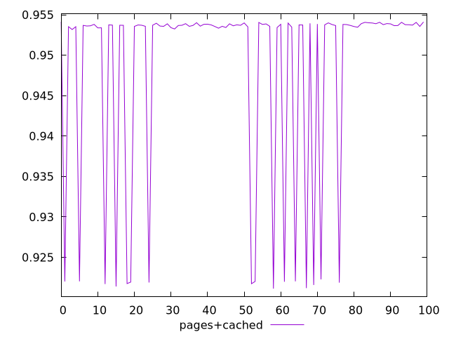
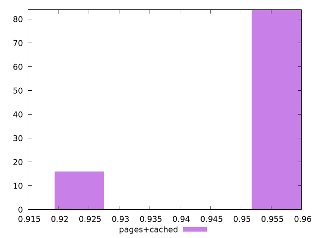
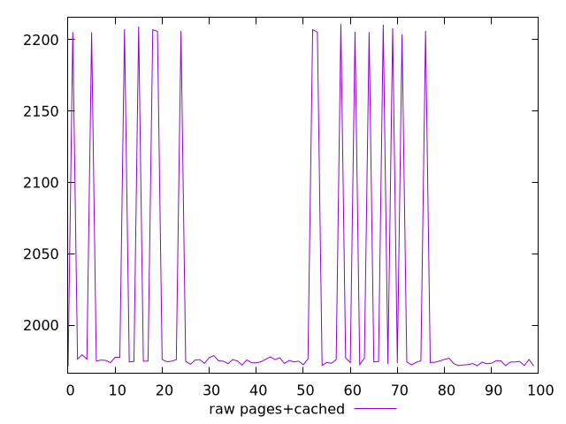
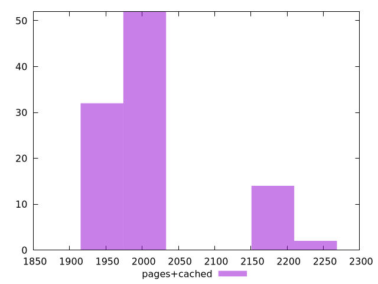

# Report pages+cached

[parent..](./..)  


## Scores

  

## Score Histogram

  

## Score Indicators

```yaml
min: 0.9211227188567672
max: 0.9541324656892539
range: 0.0330097468324867
mean: 0.9486157237902612
median: 0.9536908125857045
stdev: 0.011714950891835814
skewness: -1.8542699950138404

```

## Raw Values

  

## Raw Values Histogram

  

## Raw Indicators

```yaml
min: 1971.047
max: 2210.9303
range: 239.88329999999996
mean: 2011.677793499999
median: 1974.8316999999997
stdev: 85.1695385652117
skewness: 1.8537599943749237

```

<style>
  img {
    max-width: 80%;
  }
</style>
      
