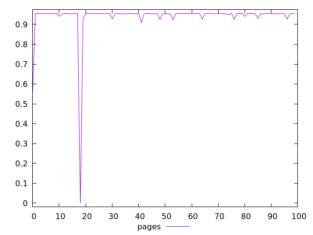
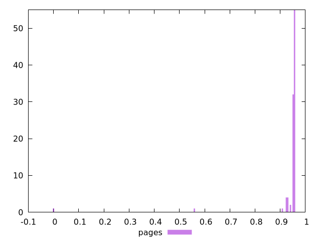
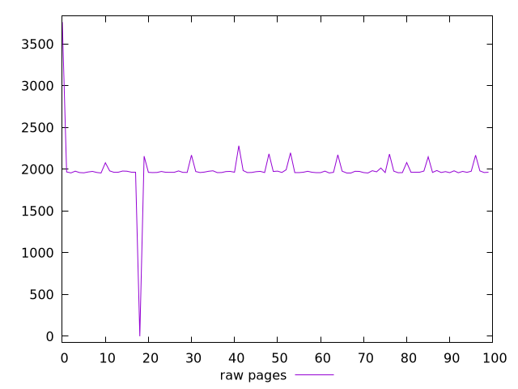
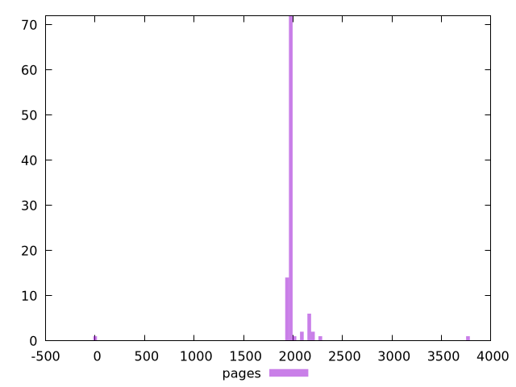

# Report pages

[parent..](./..)  


## Scores

  

## Score Histogram

  

## Score Indicators

```yaml
min: 0
max: 0.9560388344767334
range: 0.9560388344767334
mean: 0.9381654094186661
median: 0.9548972369666067
stdev: 0.10246063723301671
skewness: -8.182566958111005

```

## Raw Values

  

## Raw Values Histogram

  

## Raw Indicators

```yaml
min: 0
max: 3760.942
range: 3760.942
mean: 1987.00121
median: 1963.5405
stdev: 274.14411029828074
skewness: -1.0608267994122458

```

<style>
  img {
    max-width: 80%;
  }
</style>
      
