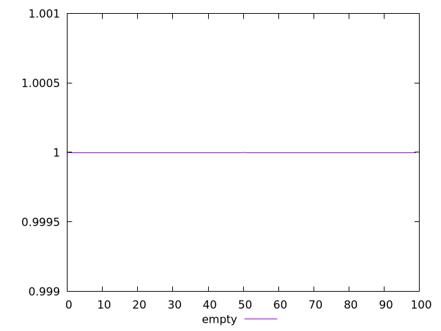
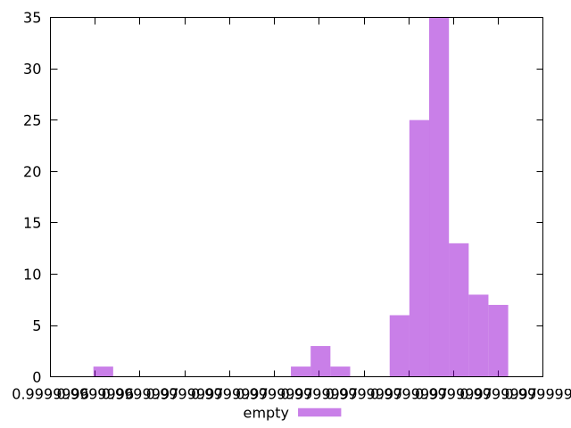

# Report empty

[parent..](./..)  


## Scores

  

## Score Histogram

  

## Score Indicators

```yaml
min: 0.9999996430838234
max: 0.9999997306130393
range: 8.752921587529272e-8
mean: 0.9999997144997254
median: 0.9999997157306404
stdev: 1.097618291374865e-8
skewness: -3.074770422112723

```

## Raw Values

  

## Raw Values Histogram

  

## Raw Indicators

```yaml
min: 625.2028
max: 641.299
range: 16.096199999999953
mean: 628.4454029999998
median: 628.2351249999999
stdev: 2.0812972094804225
skewness: 2.6546478206083743

```

<style>
  img {
    max-width: 80%;
  }
</style>
      
