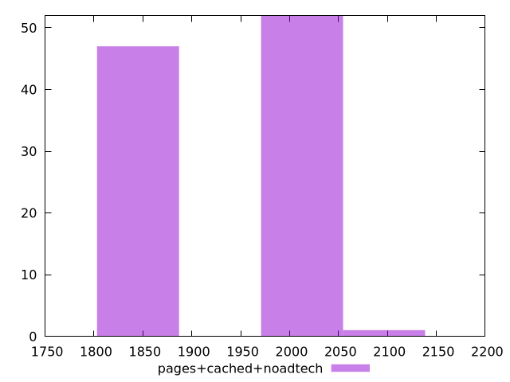

# Report pages+cached+noadtech

[parent..](./..)  


## Scores

  

## Score Histogram

  

## Score Indicators

```yaml
min: 0.9931517580410165
max: 0.9968344402663621
range: 0.0036826822253456237
mean: 0.9950723578749856
median: 0.9946383788502403
stdev: 0.0016646955627220303
skewness: -0.03364741662903664

```

## Raw Values

  

## Raw Values Histogram

  

## Raw Indicators

```yaml
min: 1815.6154
max: 2054.8825
range: 239.26710000000026
mean: 1933.0074245000003
median: 1973.5350999999996
stdev: 108.80960479278805
skewness: -0.007680753910715405

```

<style>
  img {
    max-width: 80%;
  }
</style>
      
