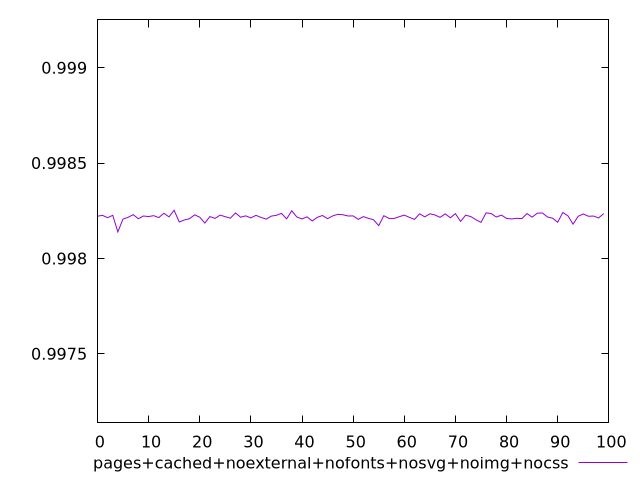
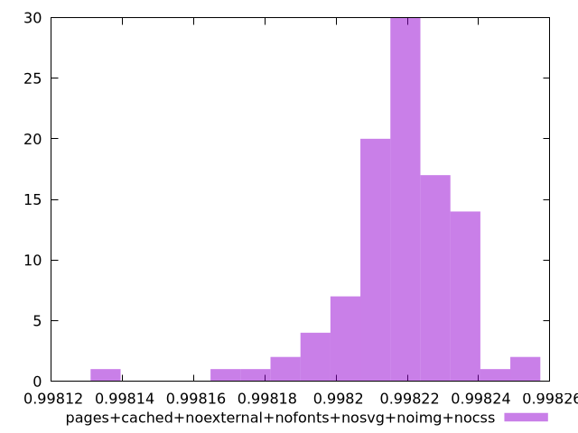
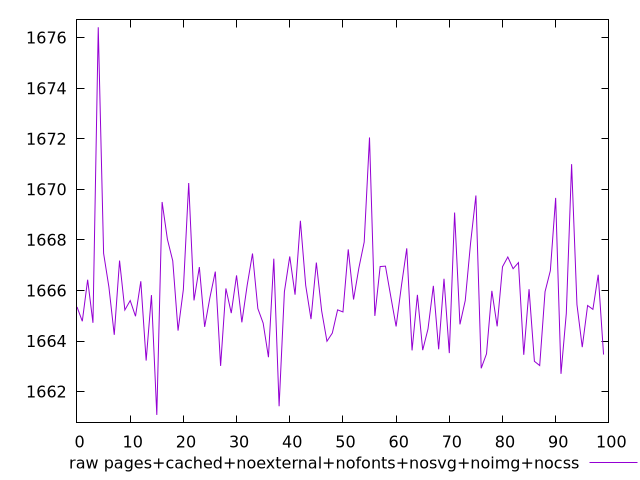
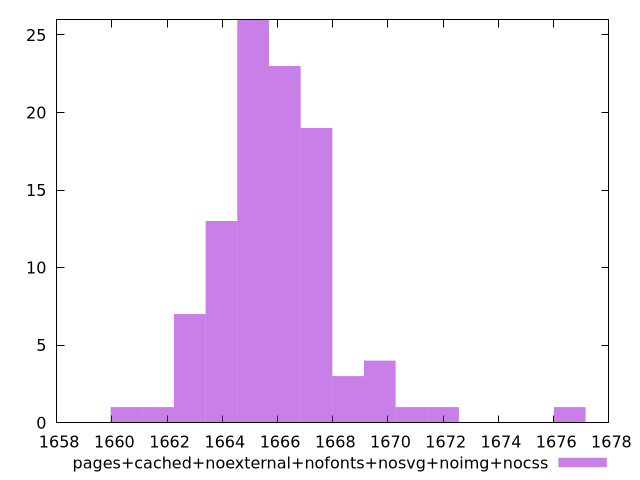

# Report pages+cached+noexternal+nofonts+nosvg+noimg+nocss

[parent..](./..)  


## Scores

  

## Score Histogram

  

## Score Indicators

```yaml
min: 0.9981393977188837
max: 0.9982528681049141
range: 0.00011347038603037873
mean: 0.9982176556417479
median: 0.9982186066813931
stdev: 0.00001606440882554876
skewness: -1.373055650443902

```

## Raw Values

  

## Raw Values Histogram

  

## Raw Indicators

```yaml
min: 1661.0789999999997
max: 1676.4074999999998
range: 15.328500000000076
mean: 1665.9076719999998
median: 1665.7855
stdev: 2.1796242371601338
skewness: 1.3228080055350102

```

<style>
  img {
    max-width: 80%;
  }
</style>
      
