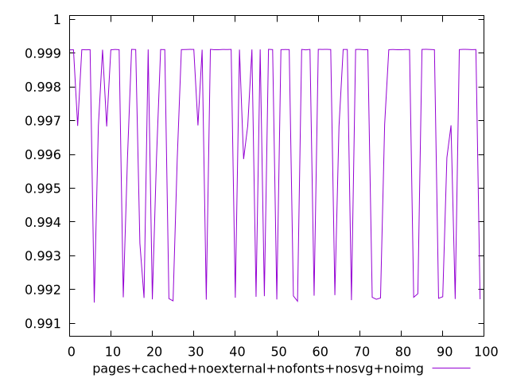
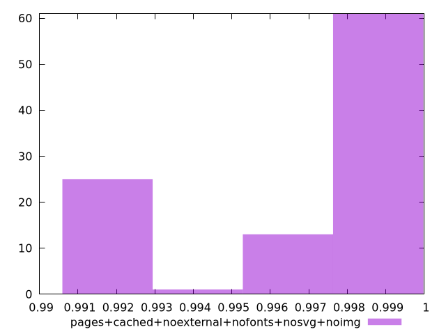

# Report pages+cached+noexternal+nofonts+nosvg+noimg

[parent..](./..)  


## Scores

  

## Score Histogram

  

## Score Indicators

```yaml
min: 0.9916125549924724
max: 0.9991115078978965
range: 0.007498952905424128
mean: 0.9968654694772452
median: 0.9991008468280018
stdev: 0.003128421201717972
skewness: -0.888983387509704

```

## Raw Values

  

## Raw Values Histogram

  

## Raw Indicators

```yaml
min: 1509.6326000000001
max: 2126.6855499999997
range: 617.0529499999996
mean: 1712.263038
median: 1512.1102
stdev: 264.47824224117693
skewness: 0.6944969339797353

```

<style>
  img {
    max-width: 80%;
  }
</style>
      
