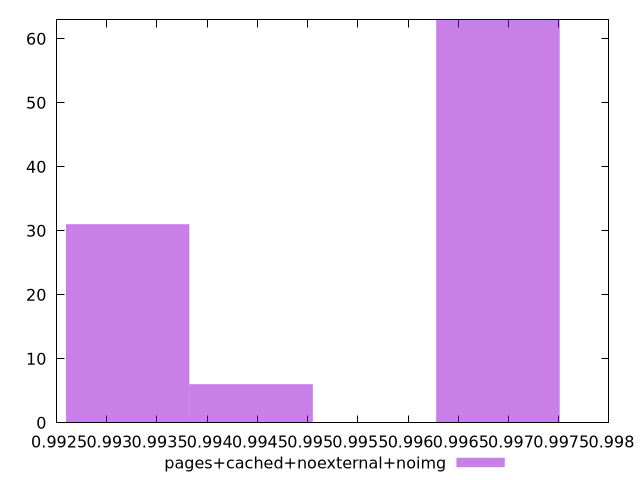

# Report pages+cached+noexternal+noimg

[parent..](./..)  


## Scores

  

## Score Histogram

  

## Score Indicators

```yaml
min: 0.993259288996361
max: 0.9968598662208406
range: 0.0036005772244795953
mean: 0.9955965521736633
median: 0.996794896964438
stdev: 0.0016107164823608259
skewness: -0.6246016274773475

```

## Raw Values

  

## Raw Values Histogram

  

## Raw Indicators

```yaml
min: 1813.3627999999999
max: 2049.4512499999996
range: 236.08844999999974
mean: 1898.0475815000004
median: 1819.0920499999997
stdev: 105.98932988298503
skewness: 0.6015278859623789

```

<style>
  img {
    max-width: 80%;
  }
</style>
      
