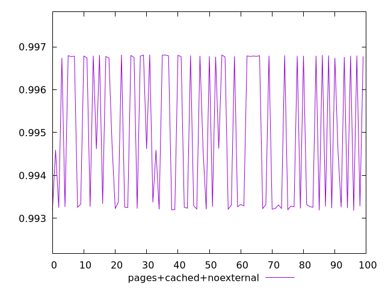
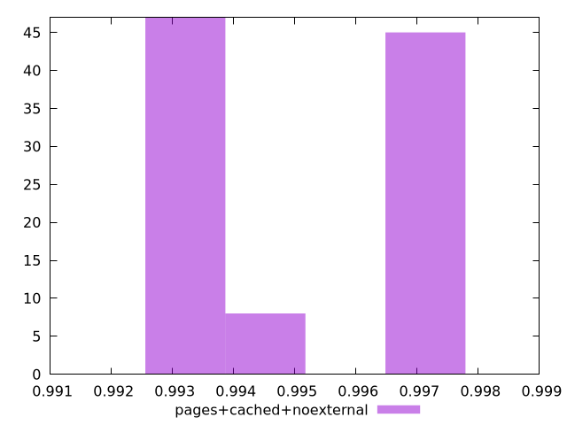
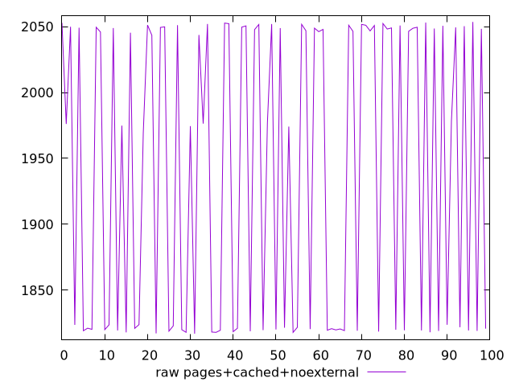
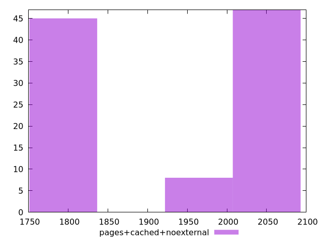

# Report pages+cached+noexternal

[parent..](./..)  


## Scores

  

## Score Histogram

  

## Score Indicators

```yaml
min: 0.9931780629005007
max: 0.9968181561693557
range: 0.003640093268854949
mean: 0.9949534659592303
median: 0.9945925804186698
stdev: 0.001693792057105572
skewness: 0.0958447269248217

```

## Raw Values

  

## Raw Values Histogram

  

## Raw Indicators

```yaml
min: 1817.0510000000002
max: 2053.5595500000004
range: 236.50855000000024
mean: 1940.2700349999996
median: 1976.2708499999999
stdev: 110.51600653595602
skewness: -0.1233576813900607

```

<style>
  img {
    max-width: 80%;
  }
</style>
      
