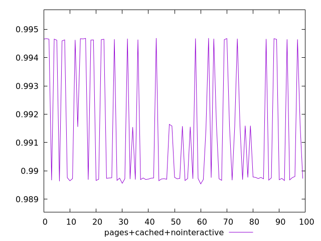
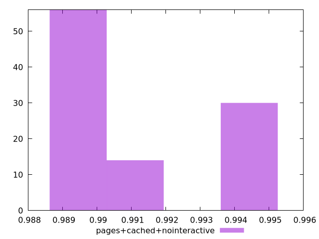
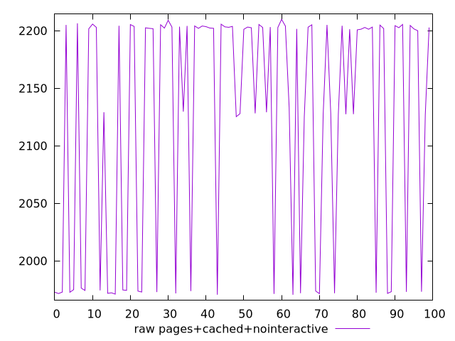

# Report pages+cached+nointeractive

[parent..](./..)  


## Scores

  

## Score Histogram

  

## Score Indicators

```yaml
min: 0.9895407029785236
max: 0.9946886299614275
range: 0.005147926982903894
mean: 0.9914546603348114
median: 0.9897650129018483
stdev: 0.0021846434778396277
skewness: 0.6544064425146447

```

## Raw Values

  

## Raw Values Histogram

  

## Raw Indicators

```yaml
min: 1970.5138999999995
max: 2209.89135
range: 239.3774500000004
mean: 2123.7290585000005
median: 2201.47345
stdev: 102.02124897354423
skewness: -0.7039388688452124

```

<style>
  img {
    max-width: 80%;
  }
</style>
      
