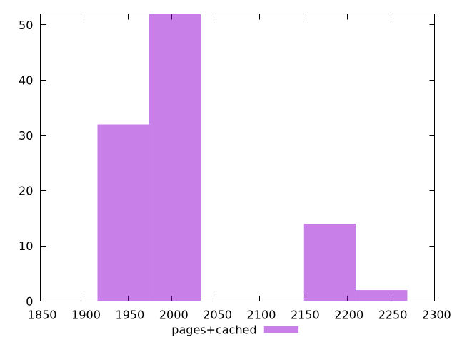

# Report pages+cached

[parent..](./..)  


## Scores

  

## Score Histogram

  

## Score Indicators

```yaml
min: 0.9895127833524604
max: 0.9946797881807303
range: 0.005167004828269928
mean: 0.9938222530674586
median: 0.99461670889041
stdev: 0.0018326567527902863
skewness: -1.8545204612500026

```

## Raw Values

  

## Raw Values Histogram

  

## Raw Indicators

```yaml
min: 1971.047
max: 2210.9303
range: 239.88329999999996
mean: 2011.677793499999
median: 1974.8316999999997
stdev: 85.1695385652117
skewness: 1.8537599943749237

```

<style>
  img {
    max-width: 80%;
  }
</style>
      
