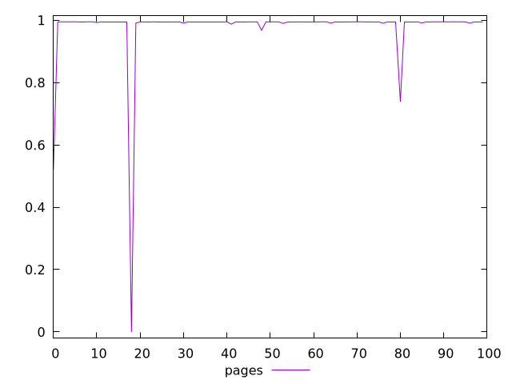
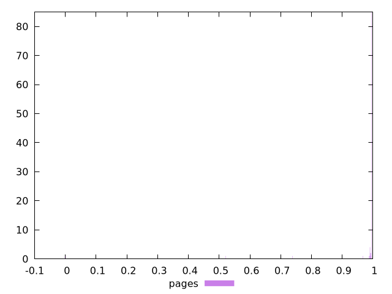
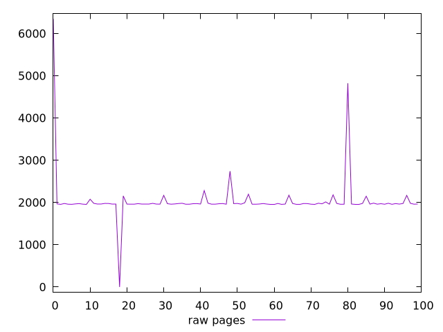
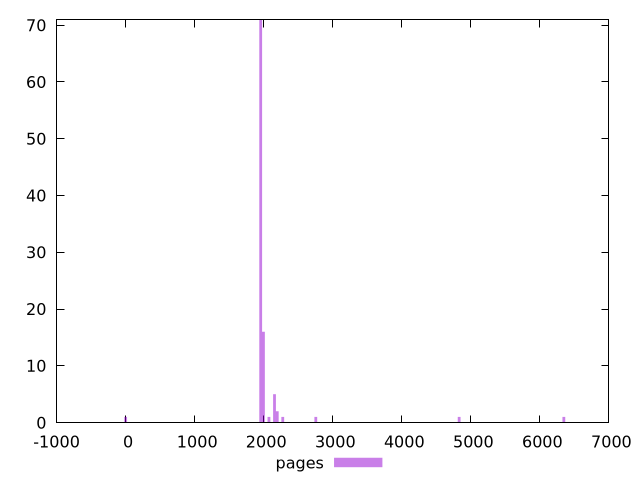

# Report pages

[parent..](./..)  


## Scores

  

## Score Histogram

  

## Score Indicators

```yaml
min: 0
max: 0.9949500401954039
range: 0.9949500401954039
mean: 0.9768385781655681
median: 0.9947885969418426
stdev: 0.1117538525808584
skewness: -7.452674259646521

```

## Raw Values

  

## Raw Values Histogram

  

## Raw Indicators

```yaml
min: 0
max: 6346.090499999998
range: 6346.090499999998
mean: 2045.8513149999997
median: 1963.5405
stdev: 561.9842082617919
skewness: 5.221208380368762

```

<style>
  img {
    max-width: 80%;
  }
</style>
      
