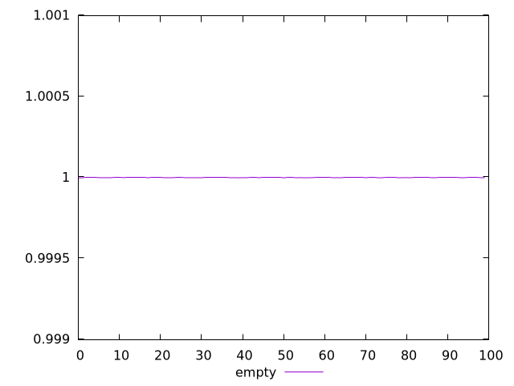

# Report empty

[parent..](./..)  


## Scores

  

## Score Histogram

  

## Score Indicators

```yaml
min: 0.9999935416590271
max: 0.9999951119777348
range: 0.0000015703187077331648
mean: 0.9999948223378269
median: 0.9999948443922725
stdev: 1.9704482653213448e-7
skewness: -3.065594402089963

```

## Raw Values

  

## Raw Values Histogram

  

## Raw Indicators

```yaml
min: 625.2028
max: 641.299
range: 16.096199999999953
mean: 628.4454029999998
median: 628.2351249999999
stdev: 2.0812972094804225
skewness: 2.6546478206083743

```

<style>
  img {
    max-width: 80%;
  }
</style>
      
