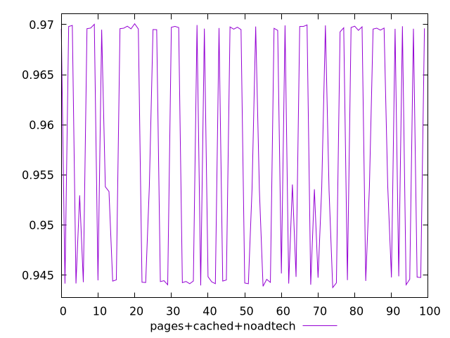
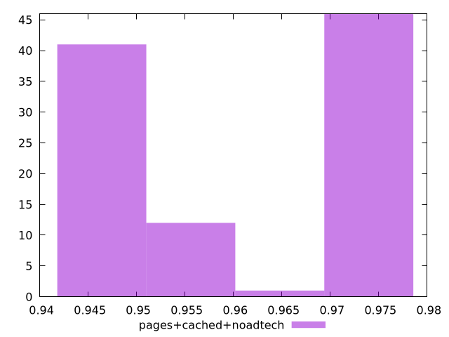
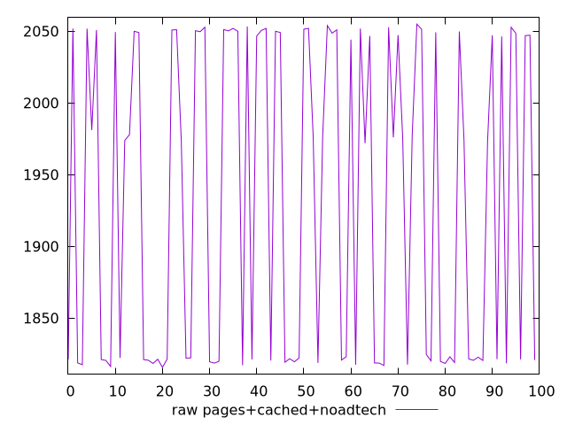

# Report pages+cached+noadtech

[parent..](./..)  


## Scores

  

## Score Histogram

  

## Score Indicators

```yaml
min: 0.9437511645876593
max: 0.9700842280134472
range: 0.026333063425787895
mean: 0.957382686803266
median: 0.9538424002145294
stdev: 0.011928113418738834
skewness: -0.019894509203728813

```

## Raw Values

  

## Raw Values Histogram

  

## Raw Indicators

```yaml
min: 1815.6154
max: 2054.8825
range: 239.26710000000026
mean: 1933.0074245000003
median: 1973.5350999999996
stdev: 108.80960479278805
skewness: -0.007680753910715405

```

<style>
  img {
    max-width: 80%;
  }
</style>
      
