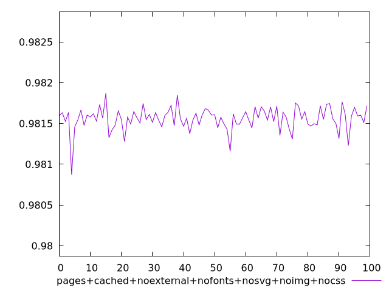
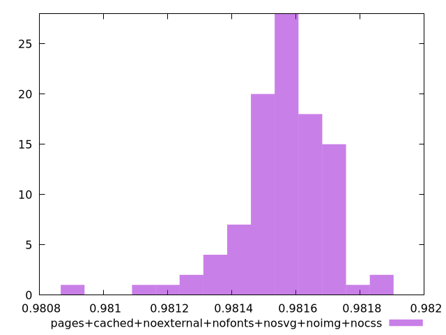
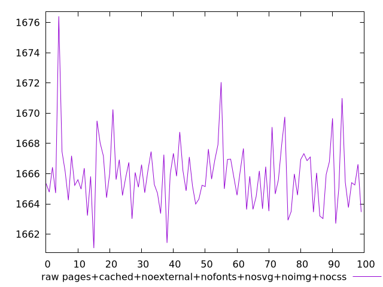

# Report pages+cached+noexternal+nofonts+nosvg+noimg+nocss

[parent..](./..)  


## Scores

  

## Score Histogram

  

## Score Indicators

```yaml
min: 0.9808721993174903
max: 0.9818696740710884
range: 0.0009974747535981265
mean: 0.9815590047211735
median: 0.9815672664569082
stdev: 0.00014136672522138054
skewness: -1.3608103596675363

```

## Raw Values

  

## Raw Values Histogram

  

## Raw Indicators

```yaml
min: 1661.0789999999997
max: 1676.4074999999998
range: 15.328500000000076
mean: 1665.9076719999998
median: 1665.7855
stdev: 2.1796242371601338
skewness: 1.3228080055350102

```

<style>
  img {
    max-width: 80%;
  }
</style>
      
