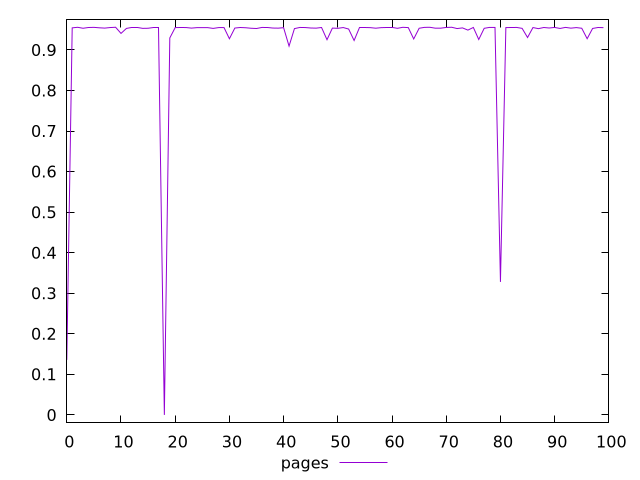
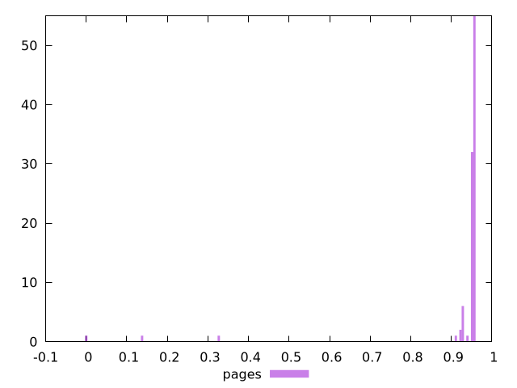
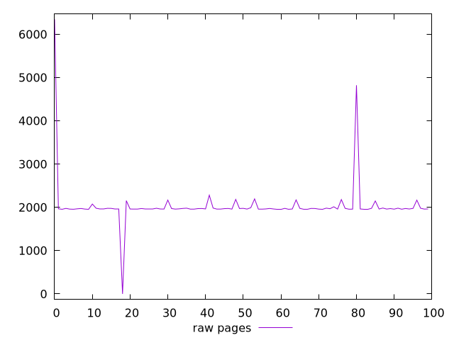
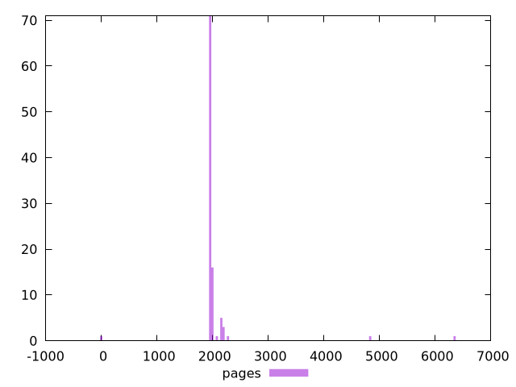

# Report pages

[parent..](./..)  


## Scores

  

## Score Histogram

  

## Score Indicators

```yaml
min: 0
max: 0.9560388344767334
range: 0.9560388344767334
mean: 0.9278152104043796
median: 0.9548972369666067
stdev: 0.13823898791060107
skewness: -5.714890717804775

```

## Raw Values

  

## Raw Values Histogram

  

## Raw Indicators

```yaml
min: 0
max: 6346.090499999998
range: 6346.090499999998
mean: 2040.2746849999996
median: 1963.5405
stdev: 557.8070766975829
skewness: 5.350151861381794

```

<style>
  img {
    max-width: 80%;
  }
</style>
      
