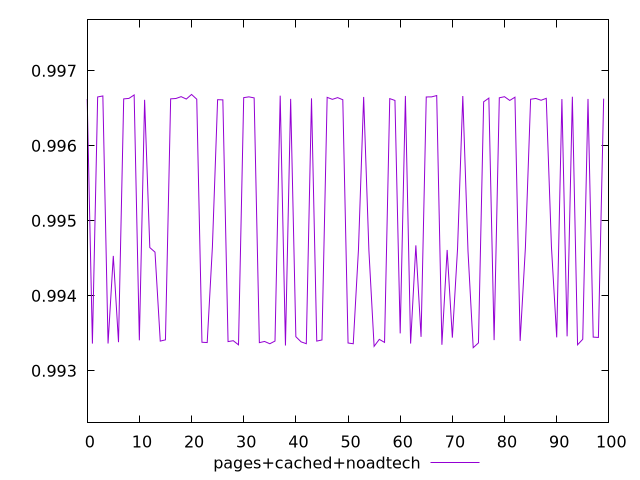
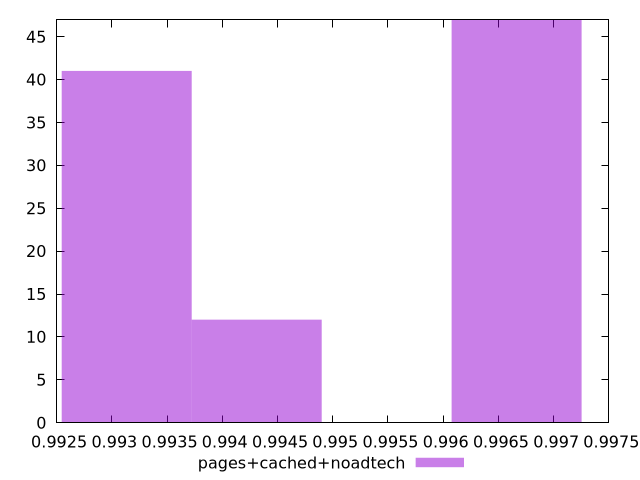
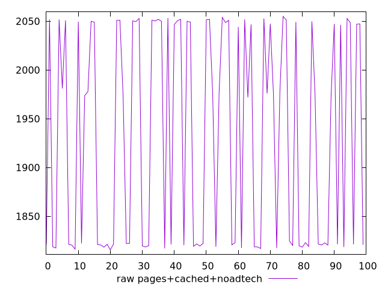
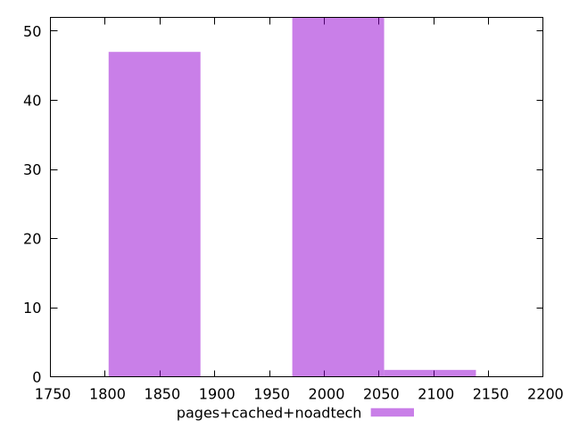

# Report pages+cached+noadtech

[parent..](./..)  


## Scores

  

## Score Histogram

  

## Score Indicators

```yaml
min: 0.993307325918704
max: 0.9966850249267895
range: 0.0033776990080854885
mean: 0.9950643782740233
median: 0.9946470966099437
stdev: 0.0015278428342164587
skewness: -0.028881676182871848

```

## Raw Values

  

## Raw Values Histogram

  

## Raw Indicators

```yaml
min: 1815.6154
max: 2054.8825
range: 239.26710000000026
mean: 1933.0074245000003
median: 1973.5350999999996
stdev: 108.80960479278805
skewness: -0.007680753910715405

```

<style>
  img {
    max-width: 80%;
  }
</style>
      
