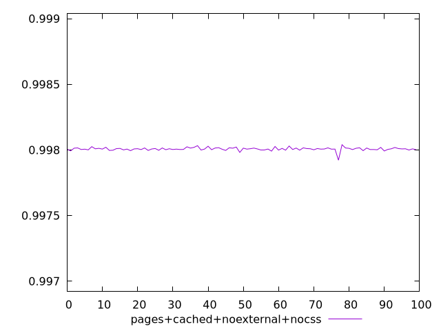
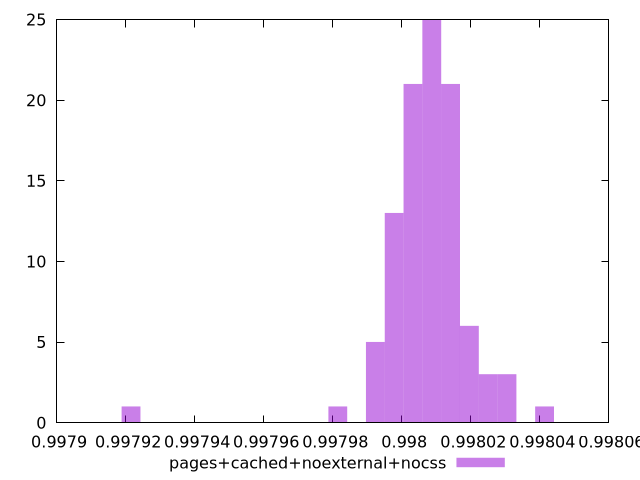
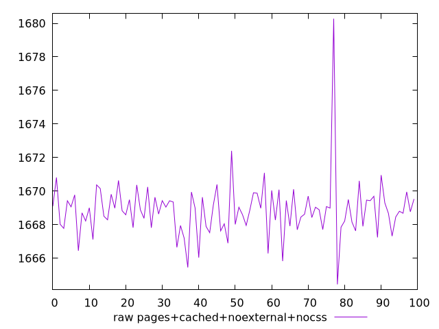
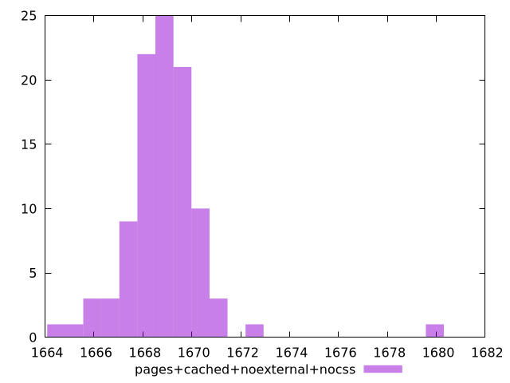

# Report pages+cached+noexternal+nocss

[parent..](./..)  


## Scores

  

## Score Histogram

  

## Score Indicators

```yaml
min: 0.9979216763333871
max: 0.9980397623871837
range: 0.00011808605379659554
mean: 0.998007319502131
median: 0.9980072052070932
stdev: 0.000012701888249405072
skewness: -2.7771782385840464

```

## Raw Values

  

## Raw Values Histogram

  

## Raw Indicators

```yaml
min: 1664.4463999999998
max: 1680.2764000000006
range: 15.830000000000837
mean: 1668.8608310000002
median: 1668.88035
stdev: 1.70838839106894
skewness: 2.6846014075817277

```

<style>
  img {
    max-width: 80%;
  }
</style>
      
