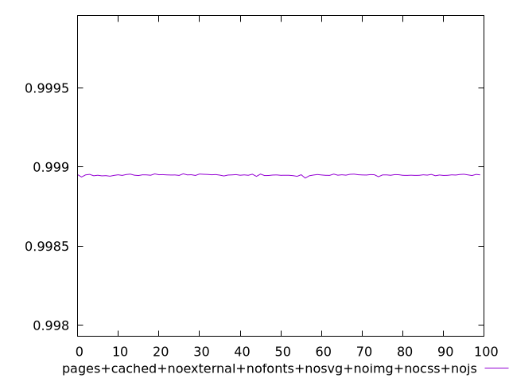
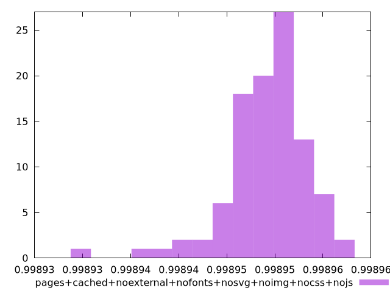
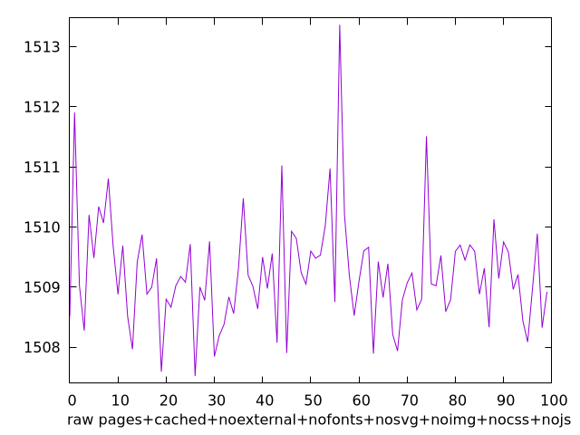

# Report pages+cached+noexternal+nofonts+nosvg+noimg+nocss+nojs

[parent..](./..)  


## Scores

  

## Score Histogram

  

## Score Indicators

```yaml
min: 0.998930223435041
max: 0.99895695416469
range: 0.00002673072964898271
mean: 0.998949171207474
median: 0.9989496959676488
stdev: 0.000004053301317222535
skewness: -1.339933212008023

```

## Raw Values

  

## Raw Values Histogram

  

## Raw Indicators

```yaml
min: 1507.5205999999998
max: 1513.3652000000004
range: 5.844600000000582
mean: 1509.232714
median: 1509.1187999999997
stdev: 0.8880748753365546
skewness: 1.3203909009366637

```

<style>
  img {
    max-width: 80%;
  }
</style>
      
