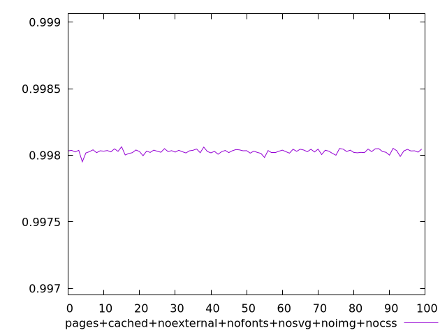
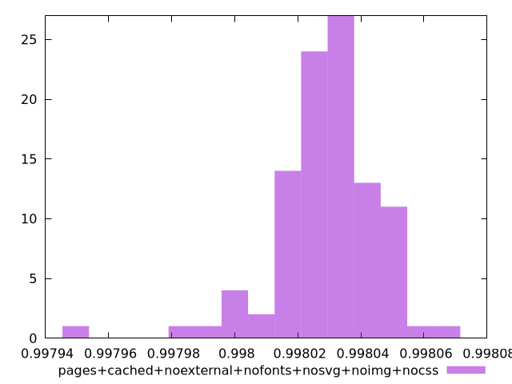
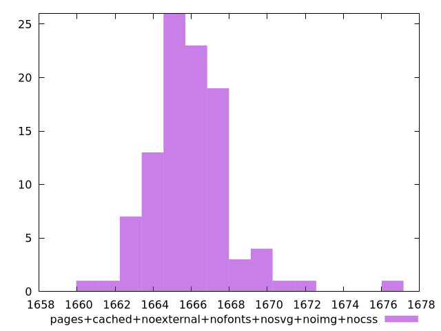

# Report pages+cached+noexternal+nofonts+nosvg+noimg+nocss

[parent..](./..)  


## Scores

  

## Score Histogram

  

## Score Indicators

```yaml
min: 0.997951013747044
max: 0.9980642215254557
range: 0.00011320777841172802
mean: 0.998029028521866
median: 0.9980299719457084
stdev: 0.000016035467619961357
skewness: -1.3671287585888339

```

## Raw Values

  

## Raw Values Histogram

  

## Raw Indicators

```yaml
min: 1661.0789999999997
max: 1676.4074999999998
range: 15.328500000000076
mean: 1665.9076719999998
median: 1665.7855
stdev: 2.1796242371601338
skewness: 1.3228080055350102

```

<style>
  img {
    max-width: 80%;
  }
</style>
      
