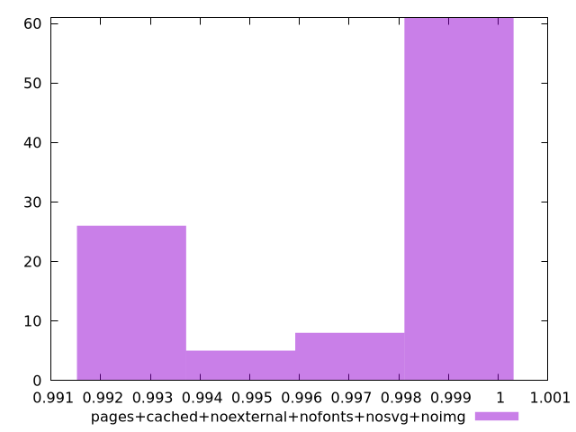

# Report pages+cached+noexternal+nofonts+nosvg+noimg

[parent..](./..)  


## Scores

  

## Score Histogram

  

## Score Indicators

```yaml
min: 0.9919432852705903
max: 0.998947354379347
range: 0.0070040691087567275
mean: 0.9968285546719379
median: 0.9989360068335901
stdev: 0.002927986850690053
skewness: -0.8689978401421066

```

## Raw Values

  

## Raw Values Histogram

  

## Raw Indicators

```yaml
min: 1509.6326000000001
max: 2126.6855499999997
range: 617.0529499999996
mean: 1712.263038
median: 1512.1102
stdev: 264.47824224117693
skewness: 0.6944969339797353

```

<style>
  img {
    max-width: 80%;
  }
</style>
      
