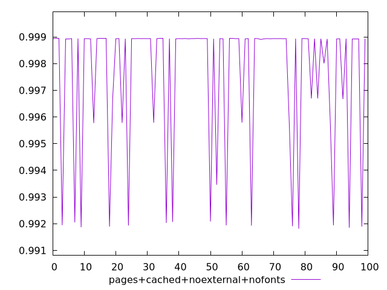
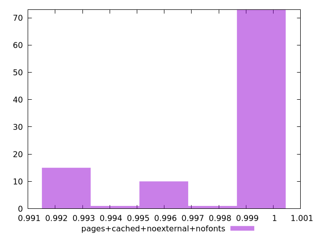
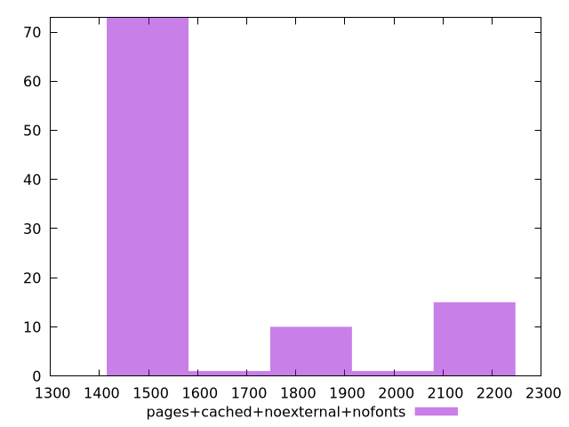

# Report pages+cached+noexternal+nofonts

[parent..](./..)  


## Scores

  

## Score Histogram

  

## Score Indicators

```yaml
min: 0.9918135799793213
max: 0.9989412896220872
range: 0.007127709642765878
mean: 0.9975412042849287
median: 0.9989330829100127
stdev: 0.002550683054852774
skewness: -1.5316129998906183

```

## Raw Values

  

## Raw Values Histogram

  

## Raw Indicators

```yaml
min: 1510.9593000000004
max: 2133.0600999999997
range: 622.1007999999993
mean: 1646.5787790000004
median: 1512.7453500000001
stdev: 232.5695596411077
skewness: 1.318544057400761

```

<style>
  img {
    max-width: 80%;
  }
</style>
      
