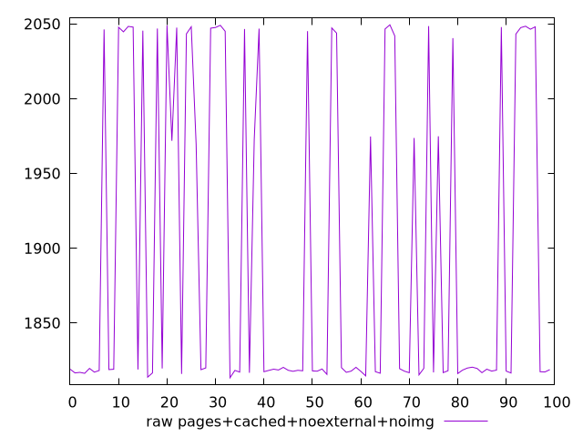

# Report pages+cached+noexternal+noimg

[parent..](./..)  


## Scores

  

## Score Histogram

  

## Score Indicators

```yaml
min: 0.9934034241864531
max: 0.996709189740467
range: 0.003305765554013851
mean: 0.9955465363661861
median: 0.9966474754216338
stdev: 0.0014794480305886923
skewness: -0.6219371003077483

```

## Raw Values

  

## Raw Values Histogram

  

## Raw Indicators

```yaml
min: 1813.3627999999999
max: 2049.4512499999996
range: 236.08844999999974
mean: 1898.0475815000004
median: 1819.0920499999997
stdev: 105.98932988298503
skewness: 0.6015278859623789

```

<style>
  img {
    max-width: 80%;
  }
</style>
      
