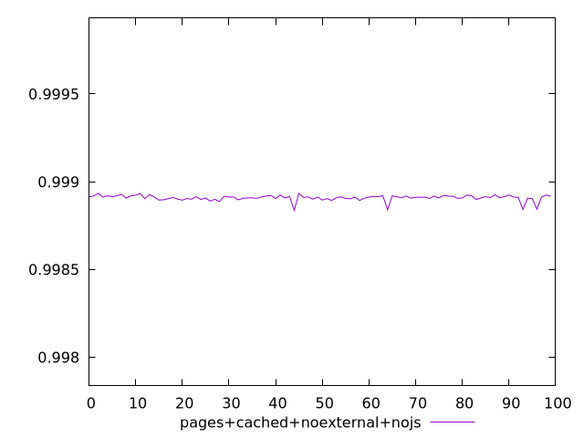
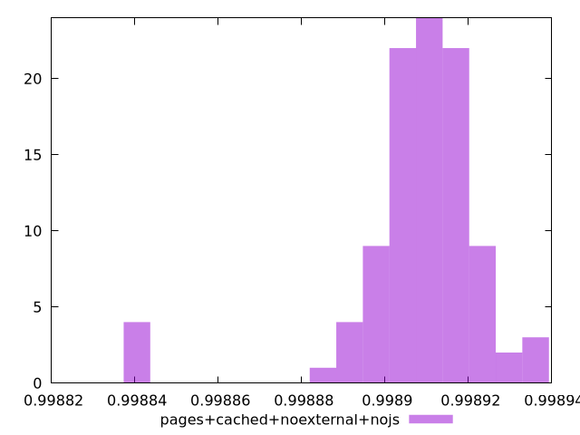
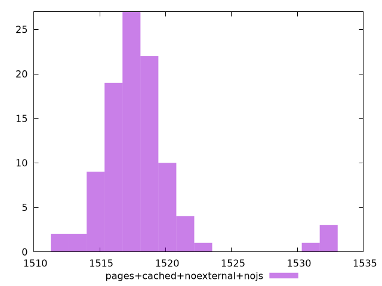

# Report pages+cached+noexternal+nojs

[parent..](./..)  


## Scores

  

## Score Histogram

  

## Score Indicators

```yaml
min: 0.9988377766483731
max: 0.9989341956393885
range: 0.00009641899101531237
mean: 0.9989083386524649
median: 0.9989111834979933
stdev: 0.000016641571111185896
skewness: -2.5086940192437983

```

## Raw Values

  

## Raw Values Histogram

  

## Raw Indicators

```yaml
min: 1512.5038
max: 1532.7559999999999
range: 20.252199999999903
mean: 1518.047556
median: 1517.4605499999998
stdev: 3.4988896429101346
skewness: 2.440616633969535

```

<style>
  img {
    max-width: 80%;
  }
</style>
      
