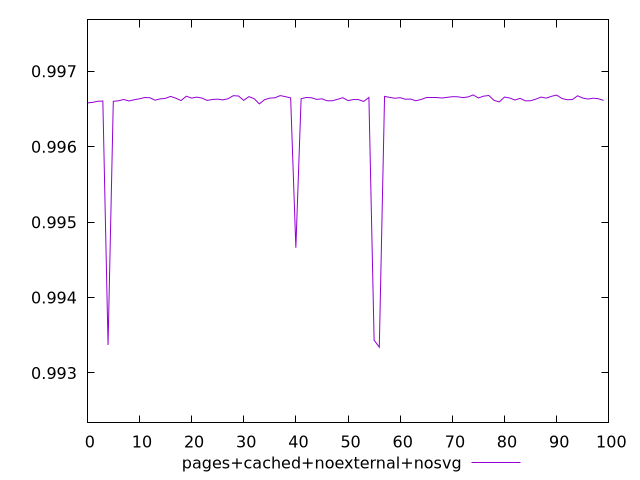
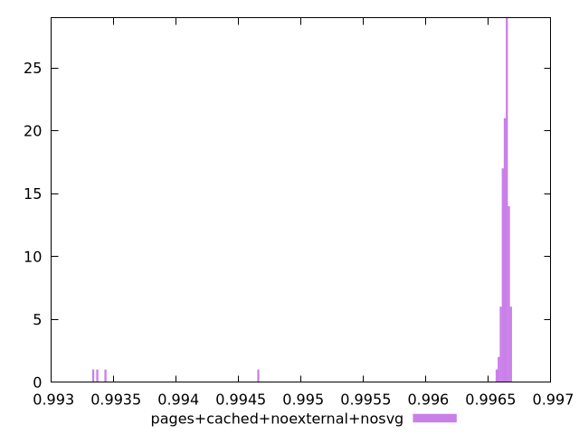
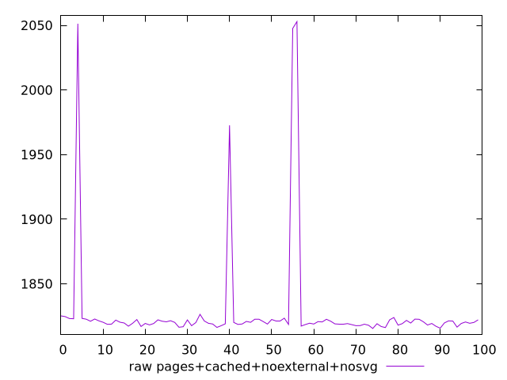

# Report pages+cached+noexternal+nosvg

[parent..](./..)  


## Scores

  

## Score Histogram

  

## Score Indicators

```yaml
min: 0.9933419051003592
max: 0.9966863746249512
range: 0.0033444695245919975
mean: 0.9965196408989868
median: 0.9966366188035553
stdev: 0.0005861801710417642
skewness: -4.910304857190335

```

## Raw Values

  

## Raw Values Histogram

  

## Raw Indicators

```yaml
min: 1815.4899
max: 2052.9345000000003
range: 237.44460000000026
mean: 1828.4910950000003
median: 1820.0919500000002
stdev: 41.96838487973685
skewness: 4.845615050421544

```

<style>
  img {
    max-width: 80%;
  }
</style>
      
