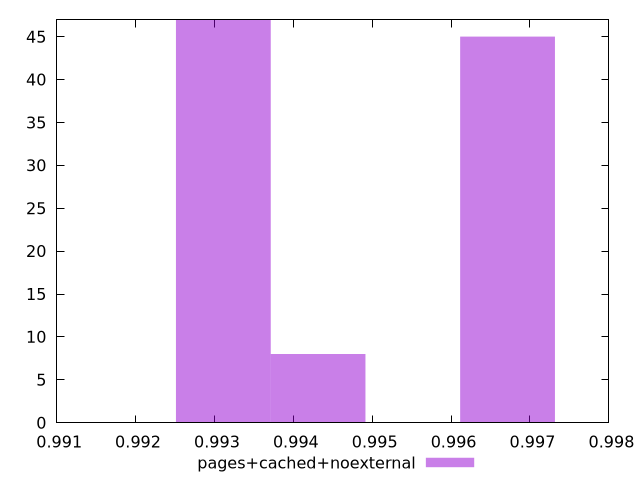

# Report pages+cached+noexternal

[parent..](./..)  


## Scores

  

## Score Histogram

  

## Score Indicators

```yaml
min: 0.9933308234388318
max: 0.9966695571280035
range: 0.0033387336891717023
mean: 0.99495603893957
median: 0.9946054271213542
stdev: 0.0015542899916154904
skewness: 0.09900338492561006

```

## Raw Values

  

## Raw Values Histogram

  

## Raw Indicators

```yaml
min: 1817.0510000000002
max: 2053.5595500000004
range: 236.50855000000024
mean: 1940.2700349999996
median: 1976.2708499999999
stdev: 110.51600653595602
skewness: -0.1233576813900607

```

<style>
  img {
    max-width: 80%;
  }
</style>
      
