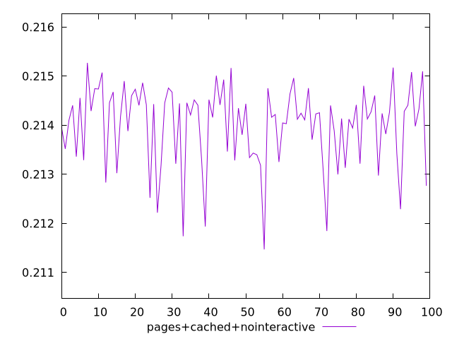
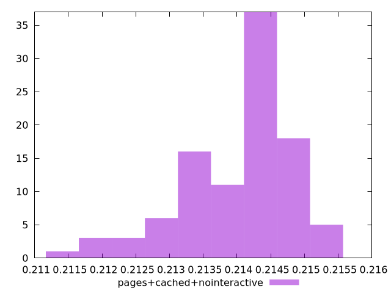
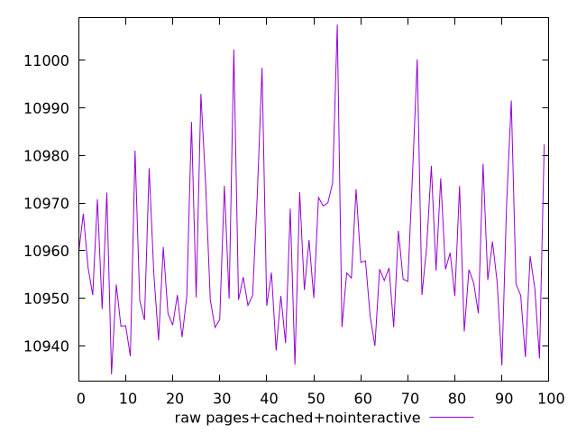
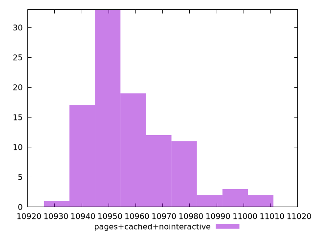

# Report pages+cached+nointeractive

[parent..](./..)  


## Scores

  

## Score Histogram

  

## Score Indicators

```yaml
min: 0.21146930975261025
max: 0.21527080235918328
range: 0.0038014926065730315
mean: 0.2139968578113086
median: 0.214224634310269
stdev: 0.0008131575923490798
skewness: -0.994461308293048

```

## Raw Values

  

## Raw Values Histogram

  

## Raw Indicators

```yaml
min: 10934.0374
max: 11007.517600000001
range: 73.48020000000179
mean: 10958.550909000009
median: 10954.134250000001
stdev: 15.701919905782873
skewness: 1.0036297739445879

```

<style>
  img {
    max-width: 80%;
  }
</style>
      
