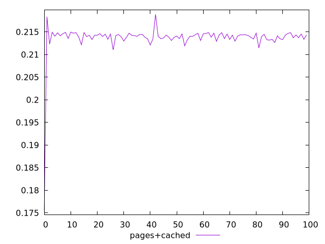
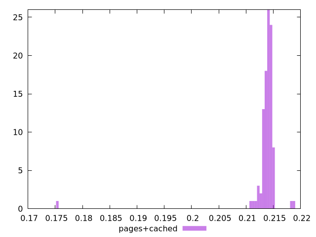
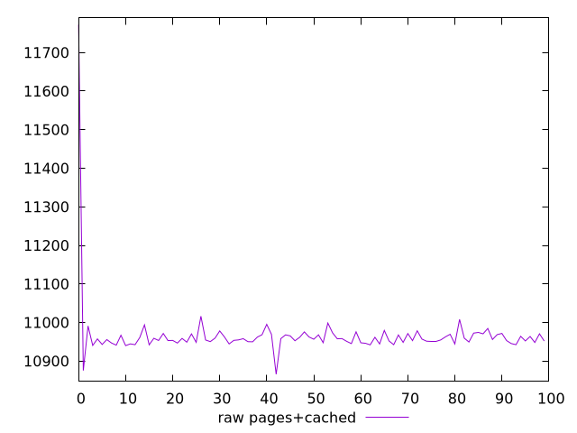
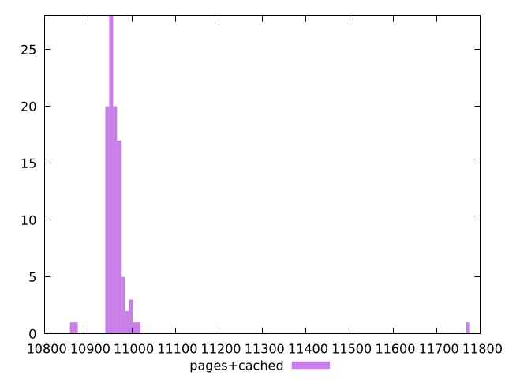

# Report pages+cached

[parent..](./..)  


## Scores

  

## Score Histogram

  

## Score Indicators

```yaml
min: 0.1755686956785158
max: 0.2188541899331023
range: 0.0432854942545865
mean: 0.21362752780451882
median: 0.21408126732443616
stdev: 0.003954457808141868
skewness: -8.8754343666634

```

## Raw Values

  

## Raw Values Histogram

  

## Raw Indicators

```yaml
min: 10865.902100000003
max: 11772.2615
range: 906.3593999999975
mean: 10966.414789000004
median: 10956.895649999999
stdev: 83.2555503587646
skewness: 9.037273352591141

```

<style>
  img {
    max-width: 80%;
  }
</style>
      
