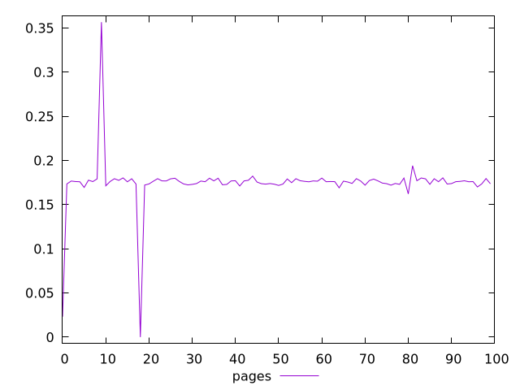
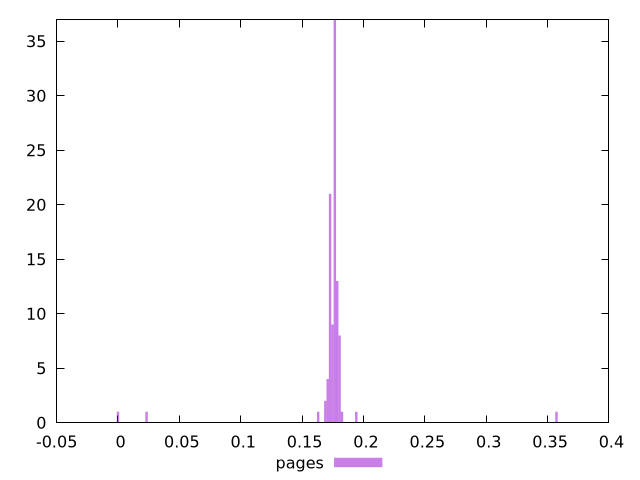
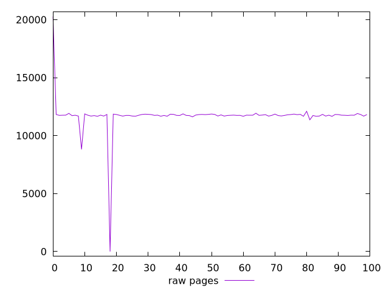
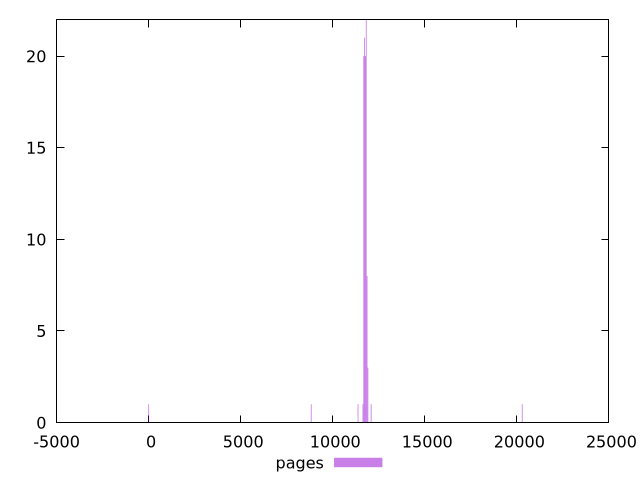

# Report pages

[parent..](./..)  


## Scores

  

## Score Histogram

  

## Score Indicators

```yaml
min: 0
max: 0.35662043990868164
range: 0.35662043990868164
mean: 0.17445085962795226
median: 0.17610874018058803
stdev: 0.02966061495199033
skewness: -1.0421773842564845

```

## Raw Values

  

## Raw Values Histogram

  

## Raw Indicators

```yaml
min: 0
max: 20273.239500000003
range: 20273.239500000003
mean: 11702.5555
median: 11759.00775
stdev: 1482.5676592268871
skewness: -3.0597841139027935

```

<style>
  img {
    max-width: 80%;
  }
</style>
      
