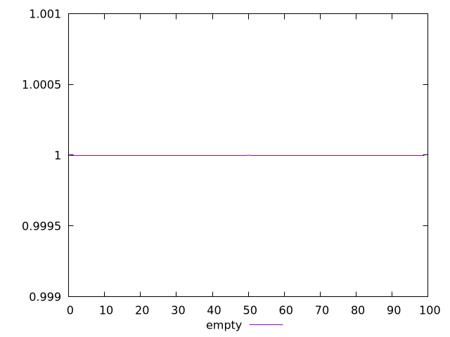
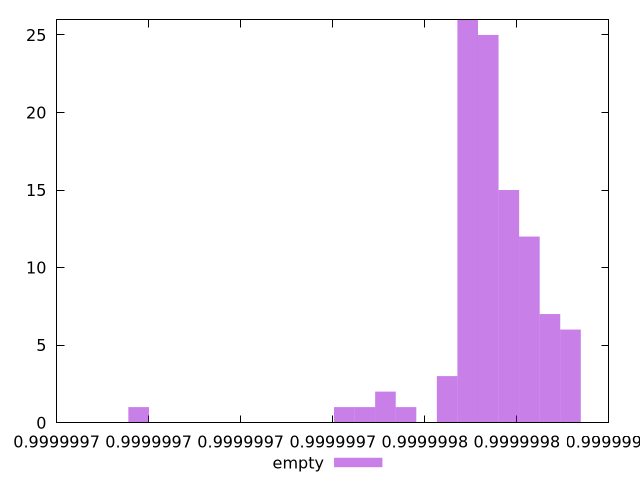
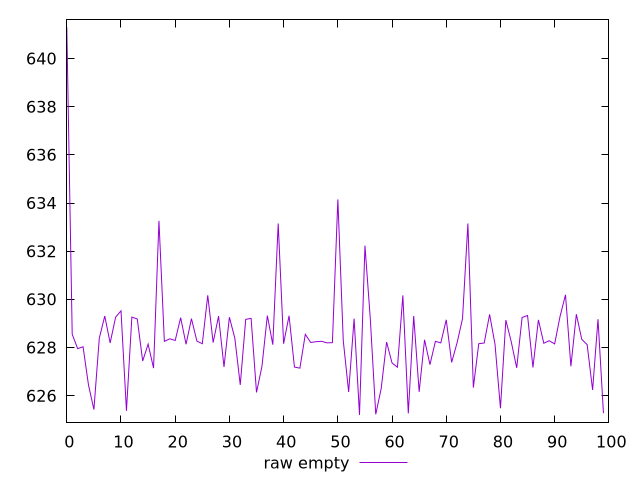
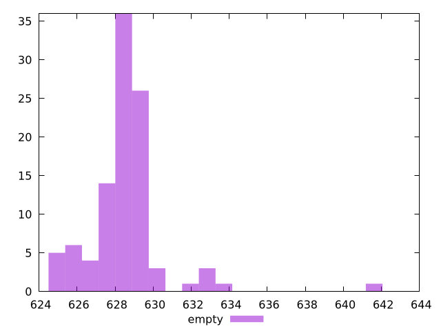

# Report empty

[parent..](./..)  


## Scores

  

## Score Histogram

  

## Score Indicators

```yaml
min: 0.999999699724551
max: 0.999999790739428
range: 9.101487696838717e-8
mean: 0.9999997744643427
median: 0.9999997757695902
stdev: 1.1306923937726408e-8
skewness: -3.2126793478405657

```

## Raw Values

  

## Raw Values Histogram

  

## Raw Indicators

```yaml
min: 625.2028
max: 641.299
range: 16.096199999999953
mean: 628.4454029999998
median: 628.2351249999999
stdev: 2.0812972094804225
skewness: 2.6546478206083743

```

<style>
  img {
    max-width: 80%;
  }
</style>
      
