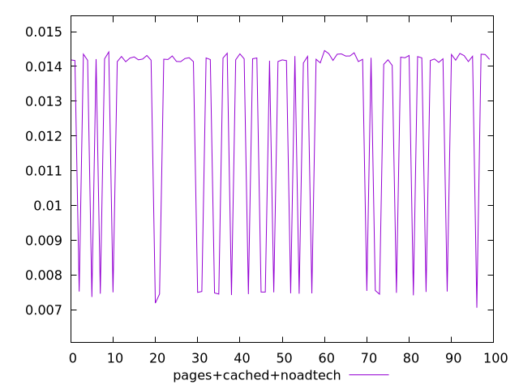
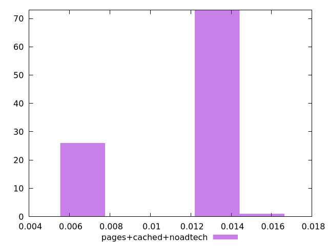
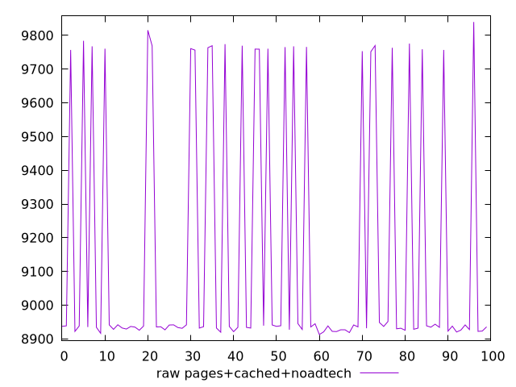
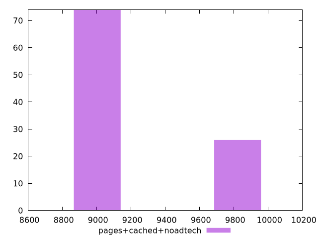

# Report pages+cached+noadtech

[parent..](./..)  


## Scores

  

## Score Histogram

  

## Score Indicators

```yaml
min: 0.0070561937628136895
max: 0.014455784236169944
range: 0.0073995904733562545
mean: 0.012471874337195356
median: 0.014189778228491906
stdev: 0.0029764319875346594
skewness: -1.0932902632171093

```

## Raw Values

  

## Raw Values Histogram

  

## Raw Indicators

```yaml
min: 8913.0792
max: 9839.7627
range: 926.6834999999992
mean: 9150.275847
median: 8937.003525
stdev: 366.909208831793
skewness: 1.0955327341811418

```

<style>
  img {
    max-width: 80%;
  }
</style>
      
