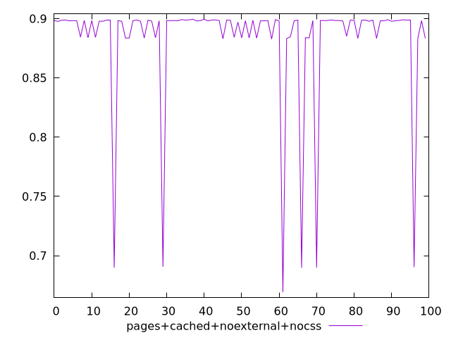
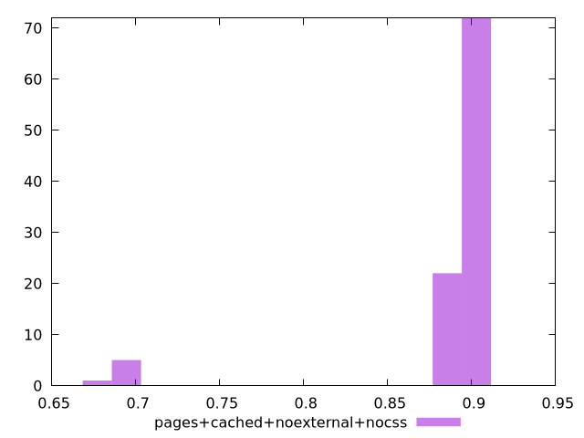
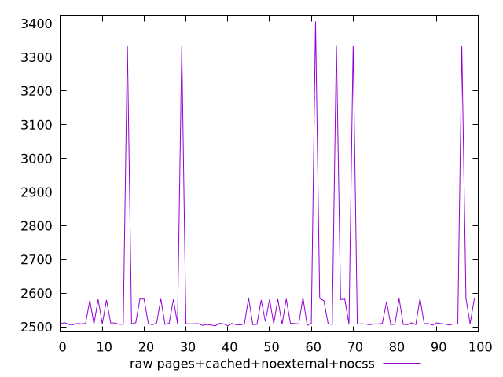
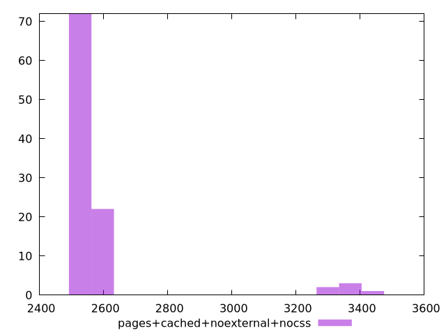

# Report pages+cached+noexternal+nocss

[parent..](./..)  


## Scores

  

## Score Histogram

  

## Score Indicators

```yaml
min: 0.6692407447954148
max: 0.8994844399510173
range: 0.2302436951556025
mean: 0.8824421837348276
median: 0.8981849967959055
stdev: 0.049882345672702014
skewness: -3.62492588134278

```

## Raw Values

  

## Raw Values Histogram

  

## Raw Indicators

```yaml
min: 2502.6894999999995
max: 3406.64035
range: 903.9508500000006
mean: 2574.8832285
median: 2509.4375
stdev: 197.4229990773904
skewness: 3.5700573446444483

```

<style>
  img {
    max-width: 80%;
  }
</style>
      
