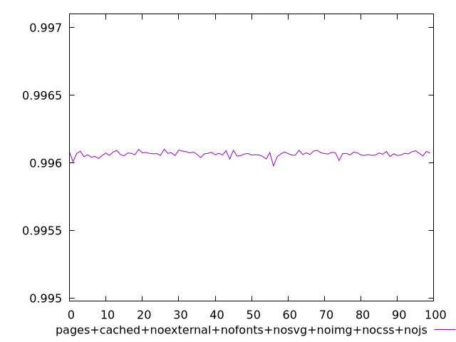
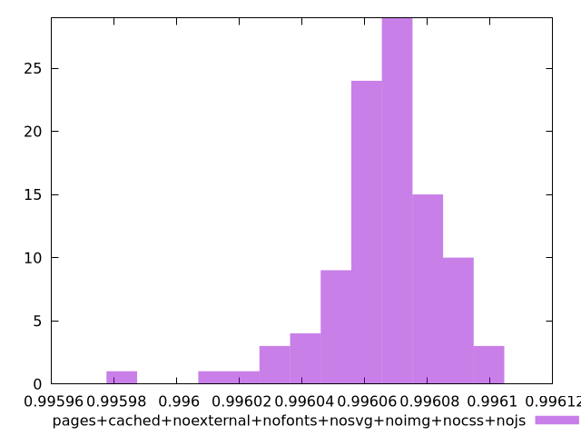
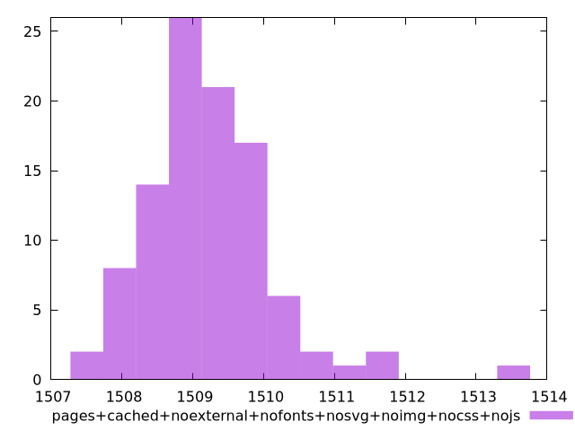

# Report pages+cached+noexternal+nofonts+nosvg+noimg+nocss+nojs

[parent..](./..)  


## Scores

  

## Score Histogram

  

## Score Indicators

```yaml
min: 0.9959780403835732
max: 0.9961019057641101
range: 0.00012386538053688056
mean: 0.9960658956816526
median: 0.9960683316481277
stdev: 0.000018772618372003202
skewness: -1.3448159538100353

```

## Raw Values

  

## Raw Values Histogram

  

## Raw Indicators

```yaml
min: 1507.5206000000003
max: 1513.3652000000004
range: 5.844600000000128
mean: 1509.232714
median: 1509.1187999999997
stdev: 0.8880748753365485
skewness: 1.3203909009368007

```

<style>
  img {
    max-width: 80%;
  }
</style>
      
