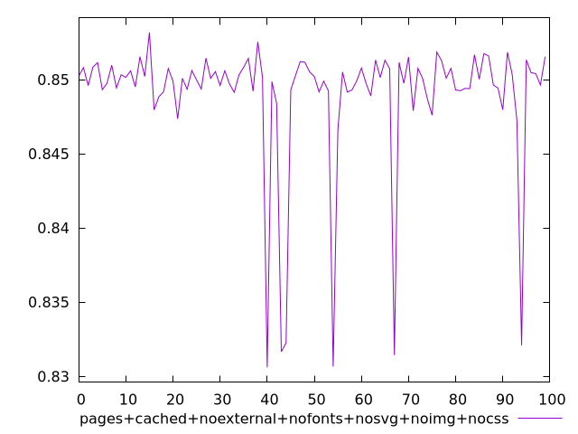
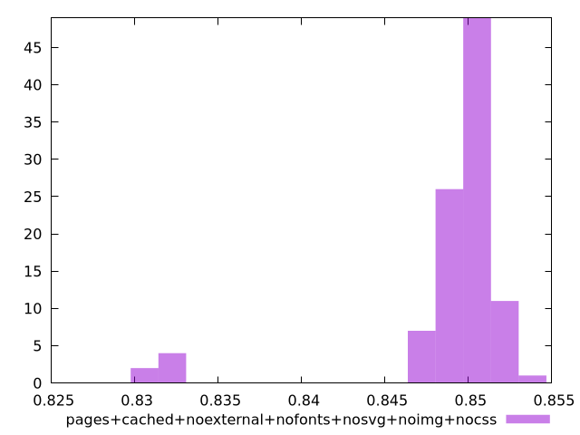
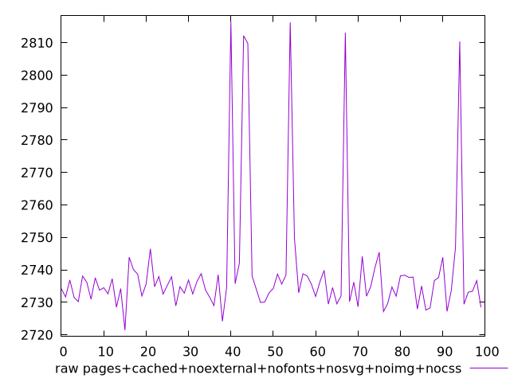
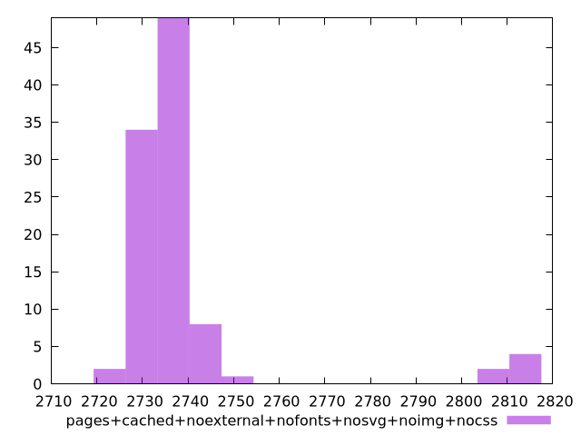

# Report pages+cached+noexternal+nofonts+nosvg+noimg+nocss

[parent..](./..)  


## Scores

  

## Score Histogram

  

## Score Indicators

```yaml
min: 0.8306030064744249
max: 0.8531784899562067
range: 0.022575483481781844
mean: 0.8489660065666795
median: 0.8500734869791052
stdev: 0.004568156599670611
skewness: -3.3466971455123775

```

## Raw Values

  

## Raw Values Histogram

  

## Raw Indicators

```yaml
min: 2721.4132999999997
max: 2816.4673
range: 95.05400000000009
mean: 2739.474298499999
median: 2734.8351000000007
stdev: 19.202509181168804
skewness: 3.3294551058832065

```

<style>
  img {
    max-width: 80%;
  }
</style>
      
