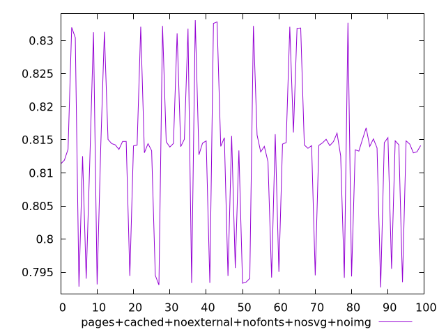
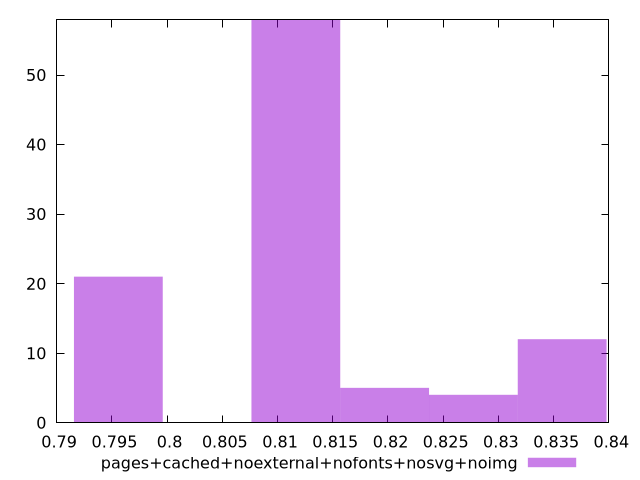
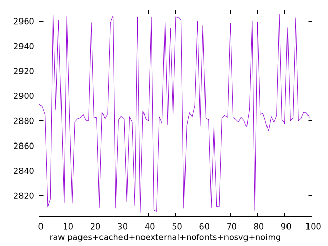
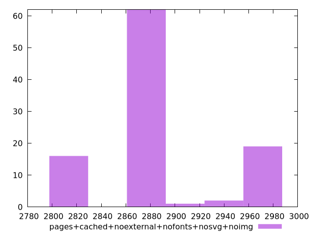

# Report pages+cached+noexternal+nofonts+nosvg+noimg

[parent..](./..)  


## Scores

  

## Score Histogram

  

## Score Indicators

```yaml
min: 0.7926830660988302
max: 0.8330685560292996
range: 0.04038548993046942
mean: 0.8127720253870062
median: 0.8141426068915294
stdev: 0.011626200212461277
skewness: -0.1680678342855888

```

## Raw Values

  

## Raw Values Histogram

  

## Raw Indicators

```yaml
min: 2806.35095
max: 2965.7074999999995
range: 159.35654999999952
mean: 2887.491505499999
median: 2882.6006749999997
stdev: 45.77470771978231
skewness: 0.11251000026313596

```

<style>
  img {
    max-width: 80%;
  }
</style>
      
