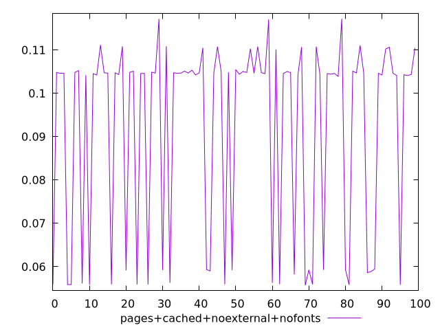
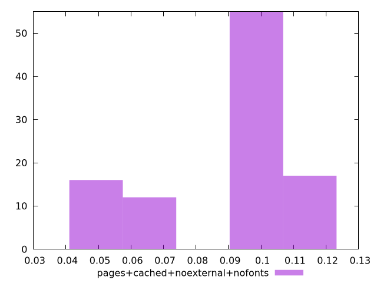
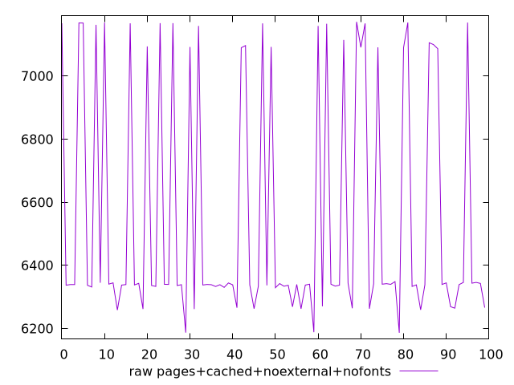
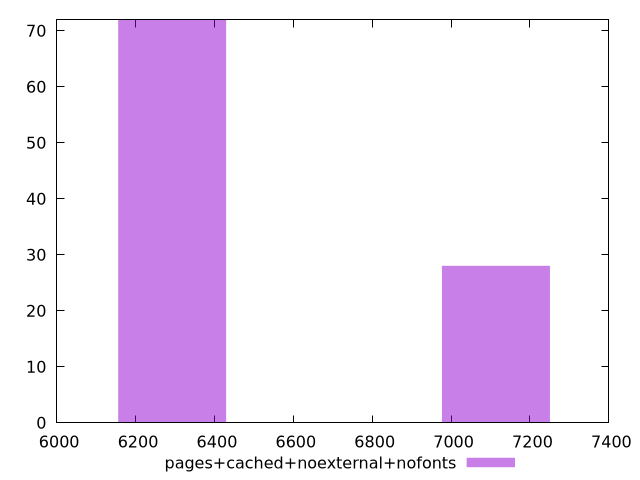

# Report pages+cached+noexternal+nofonts

[parent..](./..)  


## Scores

  

## Score Histogram

  

## Score Indicators

```yaml
min: 0.055714868999422795
max: 0.11720915159289058
range: 0.061494282593467786
mean: 0.092603901438924
median: 0.10460875239206846
stdev: 0.022218156235715342
skewness: -0.9283976799699586

```

## Raw Values

  

## Raw Values Histogram

  

## Raw Indicators

```yaml
min: 6186.534799999999
max: 7171.2513
range: 984.7165000000005
mean: 6547.060534499997
median: 6339.656025
stdev: 369.07725053321434
skewness: 0.9582788917850787

```

<style>
  img {
    max-width: 80%;
  }
</style>
      
