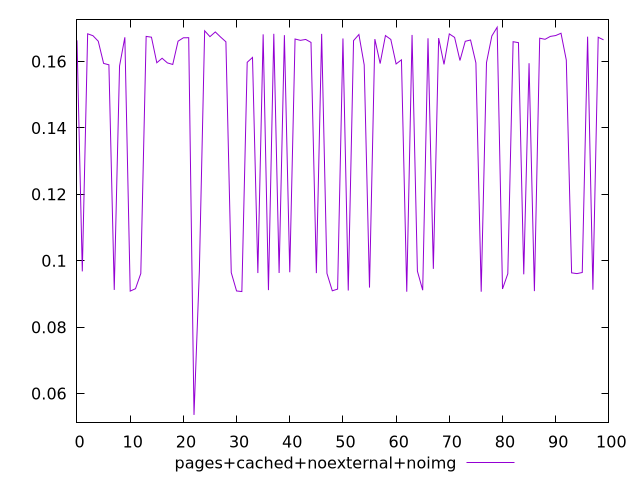
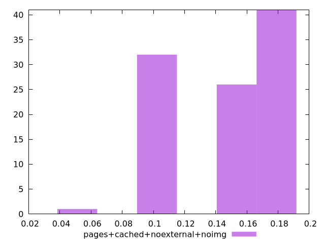
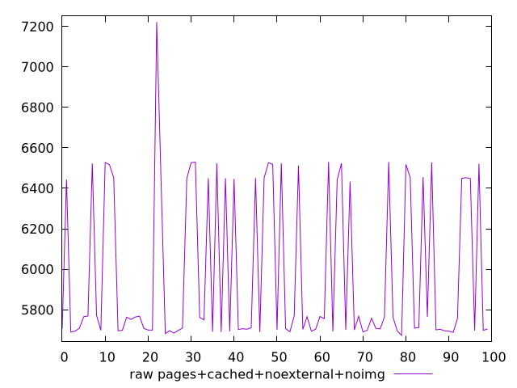
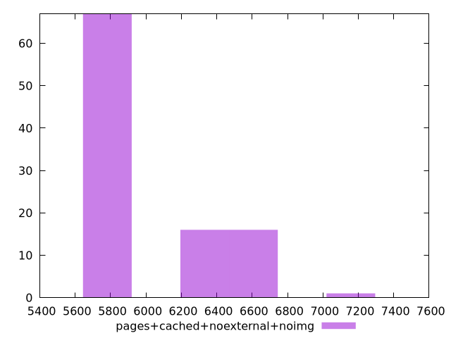

# Report pages+cached+noexternal+noimg

[parent..](./..)  


## Scores

  

## Score Histogram

  

## Score Indicators

```yaml
min: 0.053587878043642234
max: 0.17032300048272964
range: 0.1167351224390874
mean: 0.14119434365253
median: 0.16074967625240527
stdev: 0.03450474542923439
skewness: -0.7632360465870934

```

## Raw Values

  

## Raw Values Histogram

  

## Raw Indicators

```yaml
min: 5673.252550000001
max: 7221.9751
range: 1548.7225499999986
mean: 5977.930600500001
median: 5753.9097
stdev: 380.64582571802066
skewness: 0.8982110923958072

```

<style>
  img {
    max-width: 80%;
  }
</style>
      
