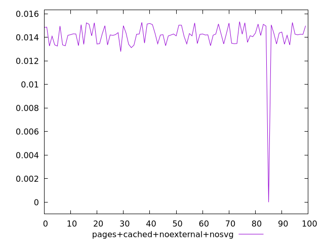
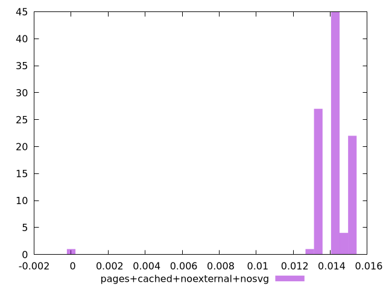
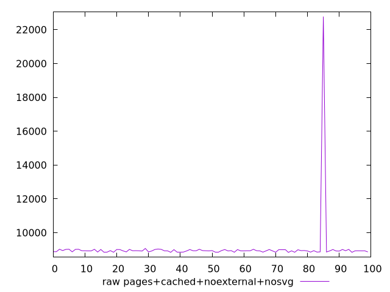
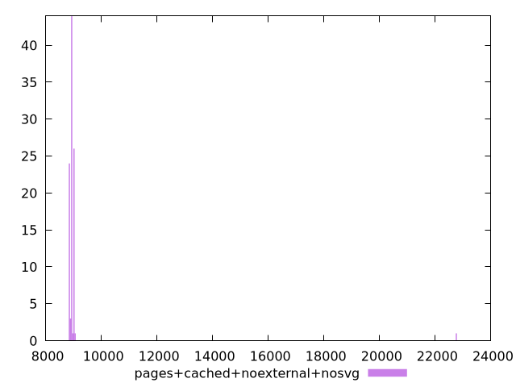

# Report pages+cached+noexternal+nosvg

[parent..](./..)  


## Scores

  

## Score Histogram

  

## Score Indicators

```yaml
min: 0.0000010572423129739938
max: 0.015333599278725352
range: 0.015332542036412378
mean: 0.014077321334225562
median: 0.014228289009323686
stdev: 0.0015562336660517322
skewness: -7.351934961448936

```

## Raw Values

  

## Raw Values Histogram

  

## Raw Indicators

```yaml
min: 8837.15625
max: 22772.47909999999
range: 13935.32284999999
mean: 9074.0391765
median: 8933.512125000001
stdev: 1378.0020376534546
skewness: 9.821897530284781

```

<style>
  img {
    max-width: 80%;
  }
</style>
      
