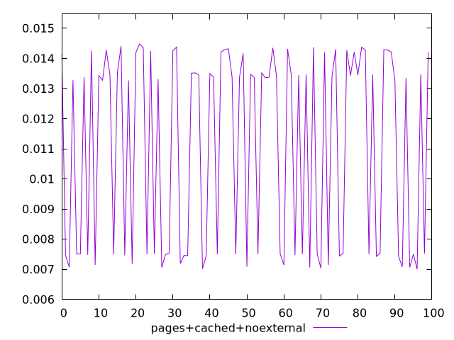
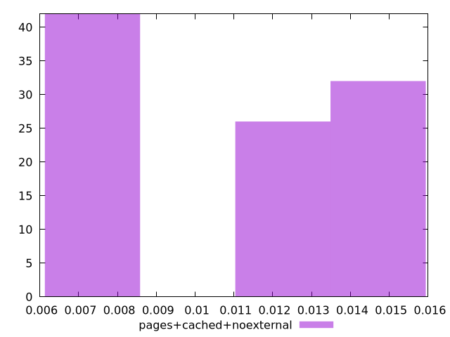
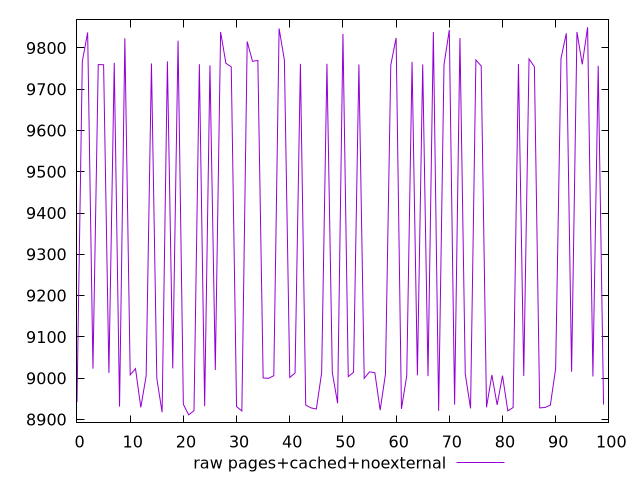
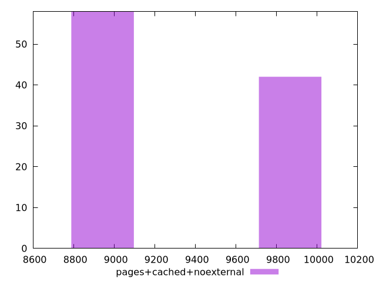

# Report pages+cached+noexternal

[parent..](./..)  


## Scores

  

## Score Histogram

  

## Score Indicators

```yaml
min: 0.006999900201620501
max: 0.014478916151333676
range: 0.007479015949713175
mean: 0.01110206063137461
median: 0.013366892591945234
stdev: 0.0032086978861867554
skewness: -0.29527836577153854

```

## Raw Values

  

## Raw Values Histogram

  

## Raw Indicators

```yaml
min: 8911.0197
max: 9850.156350000001
range: 939.1366500000004
mean: 9314.115617500001
median: 9013.97595
stdev: 403.7295345059673
skewness: 0.31512619568388867

```

<style>
  img {
    max-width: 80%;
  }
</style>
      
