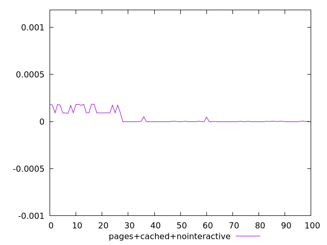
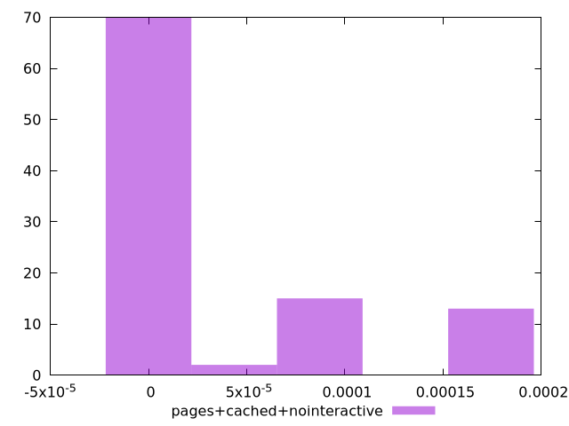
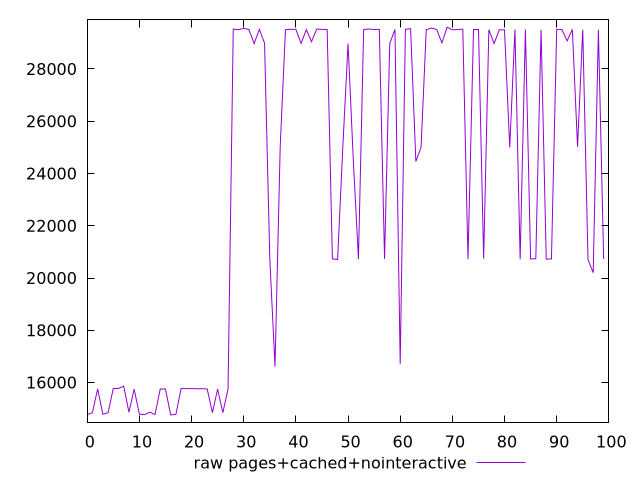
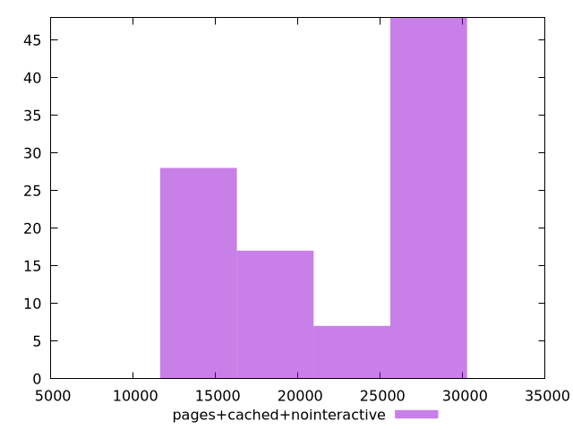

# Report pages+cached+nointeractive

[parent..](./..)  


## Scores

  

## Score Histogram

  

## Score Indicators

```yaml
min: 2.4239160678618532e-8
max: 0.00018481838554690322
range: 0.0001847941463862246
mean: 0.00003855475919791074
median: 2.896814076946974e-7
stdev: 0.00006301689150679147
skewness: 1.366518866675658

```

## Raw Values

  

## Raw Values Histogram

  

## Raw Indicators

```yaml
min: 14764.814150000002
max: 29598.0618
range: 14833.247649999998
mean: 23591.85284800002
median: 25012.90107500001
stdev: 6152.735622688291
skewness: -0.31935414190758943

```

<style>
  img {
    max-width: 80%;
  }
</style>
      
