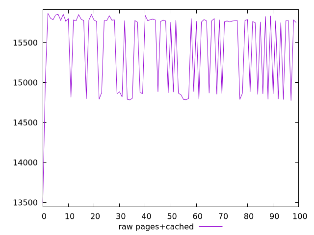

# Report pages+cached

[parent..](./..)  


## Scores

  

## Score Histogram

  

## Score Indicators

```yaml
min: 0.0000859931213034737
max: 0.0004584879220195237
range: 0.00037249480071605
mean: 0.00012501131246391795
median: 0.00009202648856498907
stdev: 0.00005275980759764143
skewness: 2.6814993539533765

```

## Raw Values

  

## Raw Values Histogram

  

## Raw Indicators

```yaml
min: 13490.808000000005
max: 15865.933949999999
range: 2375.125949999994
mean: 15422.446518499997
median: 15767.253099999998
stdev: 494.983093435556
skewness: -0.9408575438111039

```

<style>
  img {
    max-width: 80%;
  }
</style>
      
