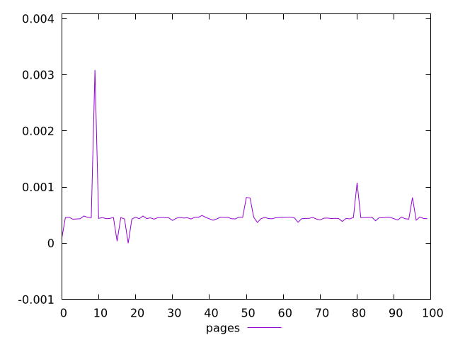
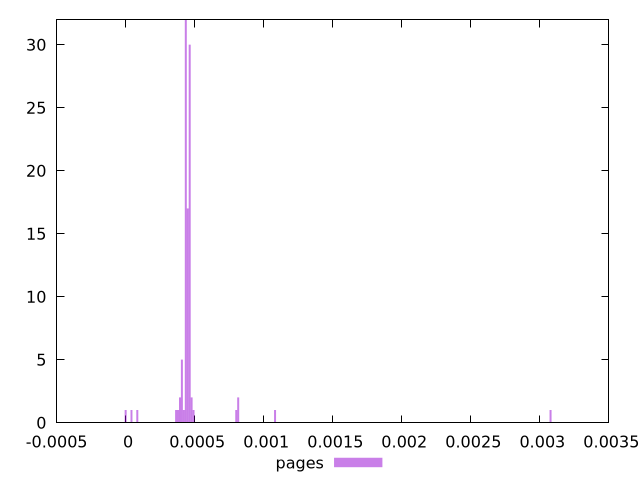
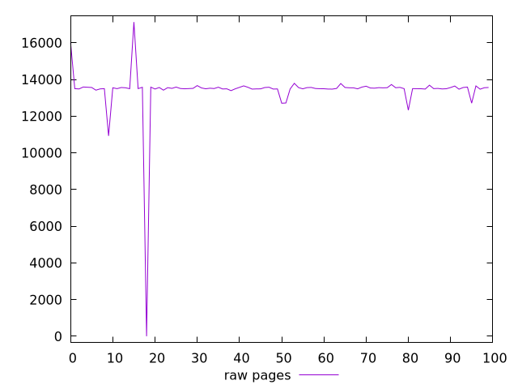
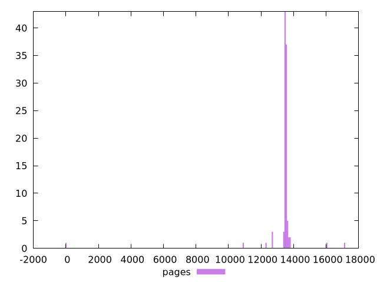

# Report pages

[parent..](./..)  


## Scores

  

## Score Histogram

  

## Score Indicators

```yaml
min: 0
max: 0.003084041261299131
range: 0.003084041261299131
mean: 0.0004763516882606628
median: 0.00045148776097800325
stdev: 0.00028645502295971304
skewness: 7.5711942965822985

```

## Raw Values

  

## Raw Values Histogram

  

## Raw Indicators

```yaml
min: 0
max: 17126.016
range: 17126.016
mean: 13396.514205
median: 13510.670750000001
stdev: 1452.7798293574497
skewness: -7.668914835934889

```

<style>
  img {
    max-width: 80%;
  }
</style>
      
