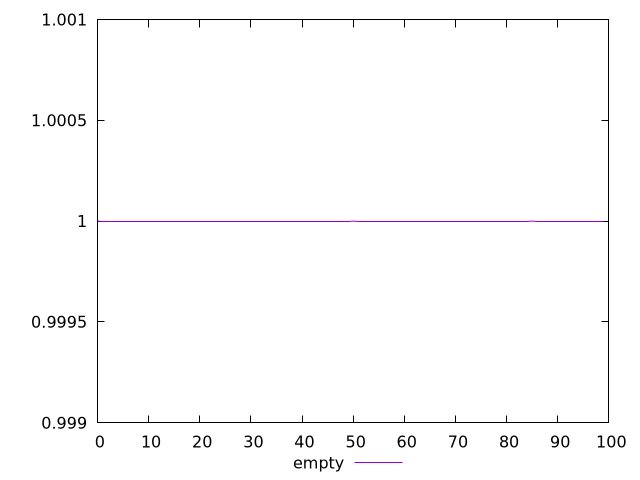
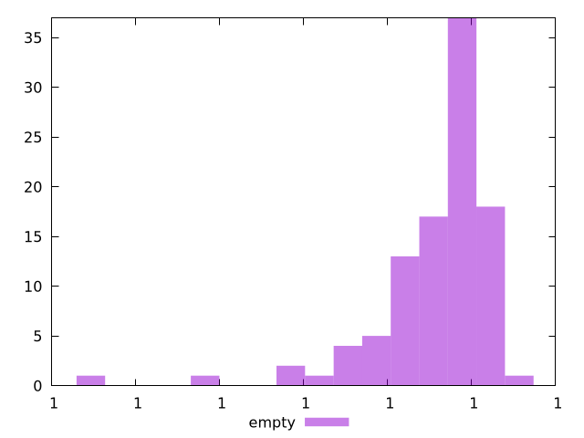
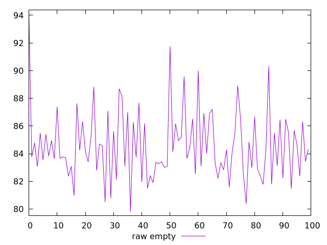
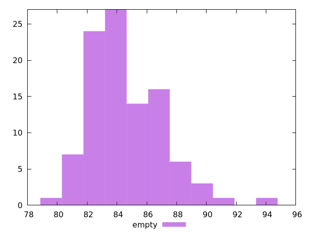

# Report empty

[parent..](./..)  


## Scores

  

## Score Histogram

  

## Score Indicators

```yaml
min: 0.999999999998871
max: 0.9999999999998814
range: 1.010413974711355e-12
mean: 0.9999999999997117
median: 0.9999999999997544
stdev: 1.4600119449609052e-13
skewness: -2.7170029345600786

```

## Raw Values

  

## Raw Values Histogram

  

## Raw Indicators

```yaml
min: 79.8
max: 94.09999999999998
range: 14.299999999999983
mean: 84.58008000000001
median: 84.1
stdev: 2.5021348312191325
skewness: 0.9667332086250979

```

<style>
  img {
    max-width: 80%;
  }
</style>
      
