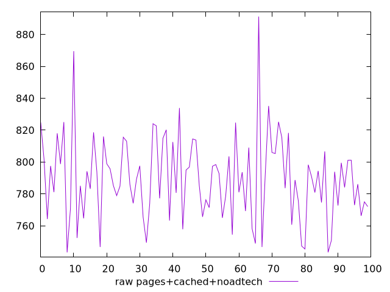

# Report pages+cached+noadtech

[parent..](./..)  


## Scores

  

## Score Histogram

  

## Score Indicators

```yaml
min: 0.9975252007940658
max: 0.9991835846940835
range: 0.0016583839000177125
mean: 0.9987850529052205
median: 0.9988104742180006
stdev: 0.0002654718128926283
skewness: -1.4306221560289358

```

## Raw Values

  

## Raw Values Histogram

  

## Raw Indicators

```yaml
min: 743.3200000000005
max: 891.2400000000005
range: 147.91999999999996
mean: 789.6182400000002
median: 789.0160000000001
stdev: 26.347828833936155
skewness: 0.6519669042867008

```

<style>
  img {
    max-width: 80%;
  }
</style>
      
