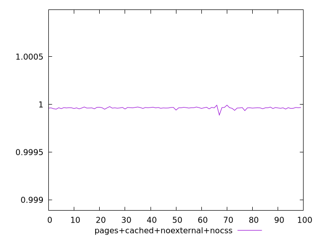
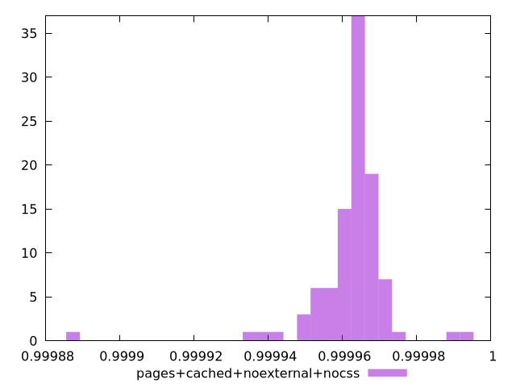
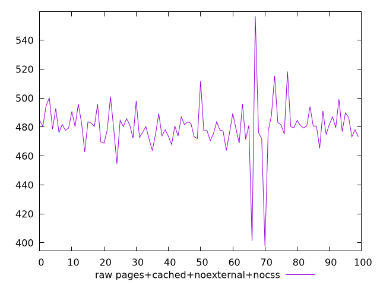
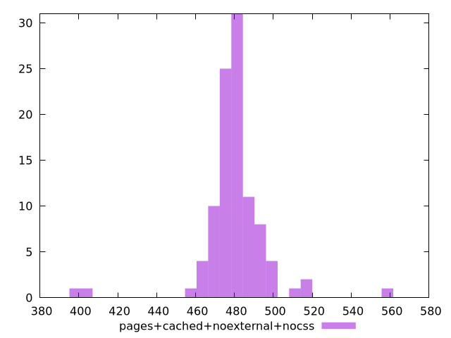

# Report pages+cached+noexternal+nocss

[parent..](./..)  


## Scores

  

## Score Histogram

  

## Score Indicators

```yaml
min: 0.9998885423135427
max: 0.9999922374275928
range: 0.00010369511405006193
mean: 0.9999625258208011
median: 0.9999636661257181
stdev: 0.00001082034319626929
skewness: -3.178495248541801

```

## Raw Values

  

## Raw Values Histogram

  

## Raw Indicators

```yaml
min: 397.56800000000015
max: 556.5600000000004
range: 158.99200000000025
mean: 480.2951200000001
median: 480.28400000000016
stdev: 17.172641866224343
skewness: -0.9509622531119686

```

<style>
  img {
    max-width: 80%;
  }
</style>
      
