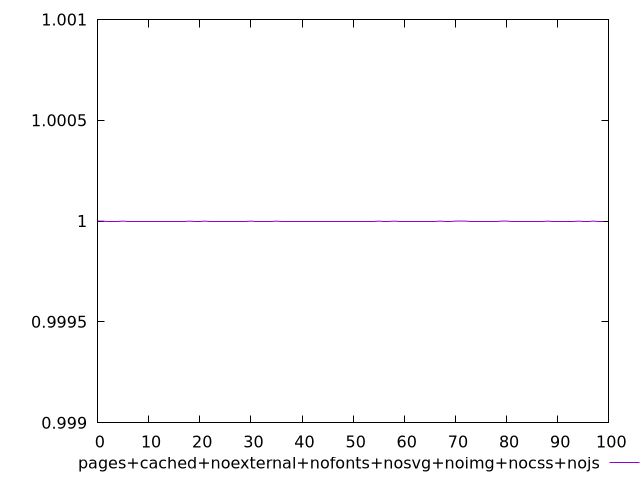
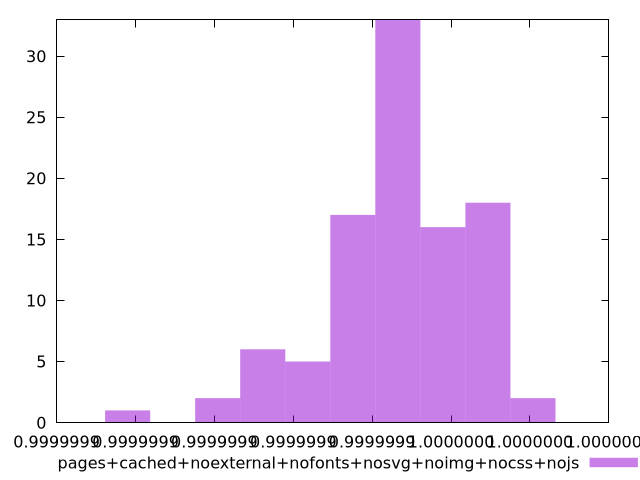
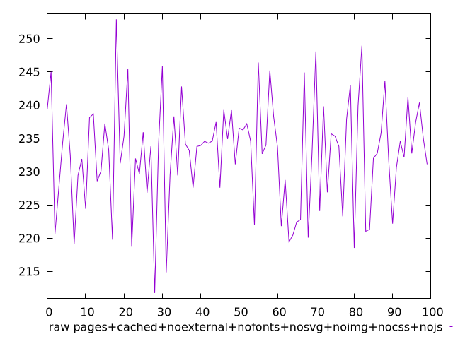
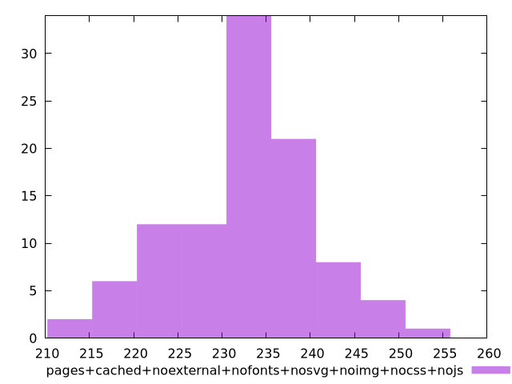

# Report pages+cached+noexternal+nofonts+nosvg+noimg+nocss+nojs

[parent..](./..)  


## Scores

  

## Score Histogram

  

## Score Indicators

```yaml
min: 0.9999998813927307
max: 0.9999999810073676
range: 9.961463698360262e-8
mean: 0.9999999461830555
median: 0.9999999465604132
stdev: 1.8668483491579883e-8
skewness: -0.7022418236555557

```

## Raw Values

  

## Raw Values Histogram

  

## Raw Indicators

```yaml
min: 211.74799999999996
max: 252.916
range: 41.168000000000035
mean: 232.75207999999998
median: 233.796
stdev: 8.011933738717516
skewness: -0.17931457687286267

```

<style>
  img {
    max-width: 80%;
  }
</style>
      
