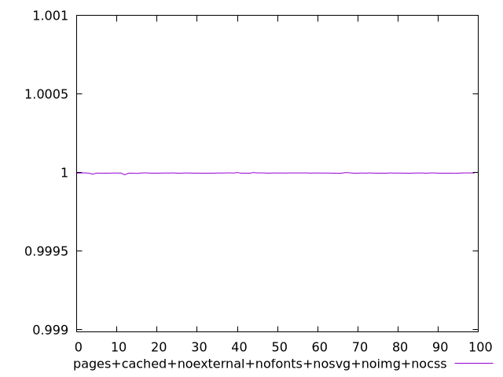
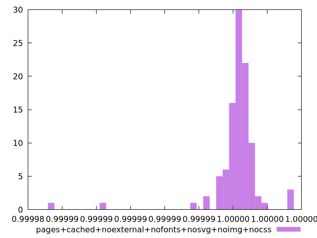
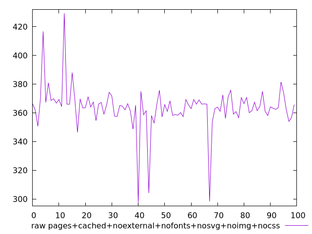
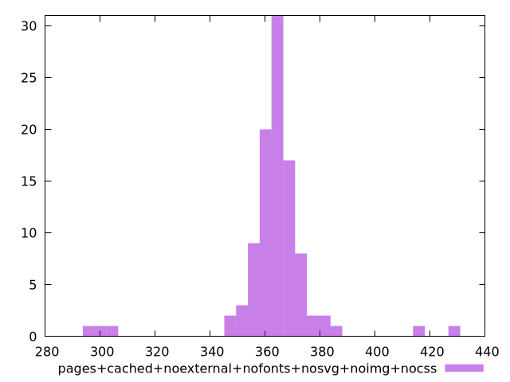

# Report pages+cached+noexternal+nofonts+nosvg+noimg+nocss

[parent..](./..)  


## Scores

  

## Score Histogram

  

## Score Indicators

```yaml
min: 0.9999852465525103
max: 0.9999994199969998
range: 0.00001417344448950697
mean: 0.9999961903242641
median: 0.999996326988454
stdev: 0.000001574508883191556
skewness: -4.315701059265691

```

## Raw Values

  

## Raw Values Histogram

  

## Raw Indicators

```yaml
min: 297.71600000000007
max: 429.336
range: 131.61999999999995
mean: 363.75840000000005
median: 364.5400000000001
stdev: 15.422099052982364
skewness: -0.9006564100670644

```

<style>
  img {
    max-width: 80%;
  }
</style>
      
