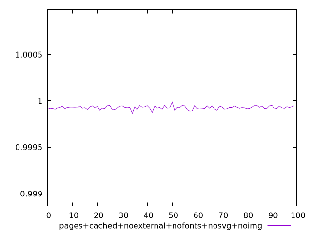
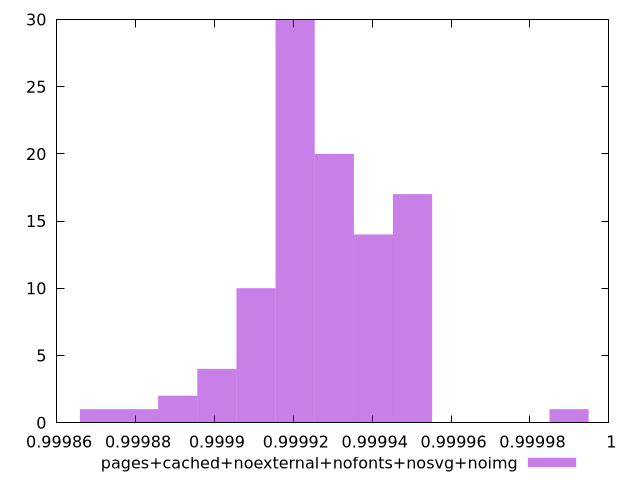
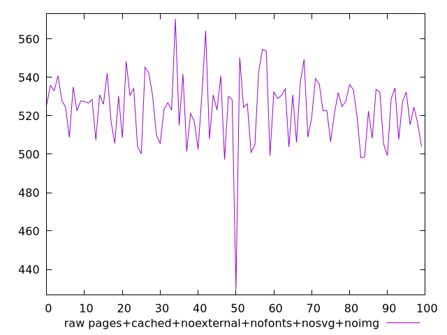
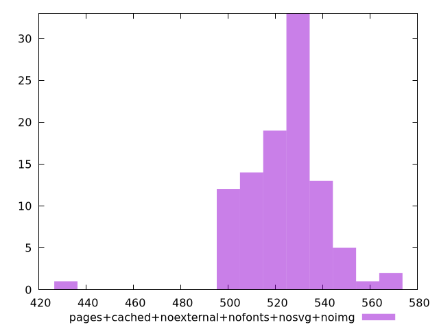

# Report pages+cached+noexternal+nofonts+nosvg+noimg

[parent..](./..)  


## Scores

  

## Score Histogram

  

## Score Indicators

```yaml
min: 0.9998665433674248
max: 0.9999851978740362
range: 0.0001186545066114153
mean: 0.9999274803076639
median: 0.999926383828121
stdev: 0.000017325126663648687
skewness: -0.3715135812297978

```

## Raw Values

  

## Raw Values Histogram

  

## Raw Indicators

```yaml
min: 429.50800000000004
max: 570.428
range: 140.91999999999996
mean: 523.6199600000002
median: 526.4280000000001
stdev: 17.92108456088522
skewness: -1.2039973447293388

```

<style>
  img {
    max-width: 80%;
  }
</style>
      
