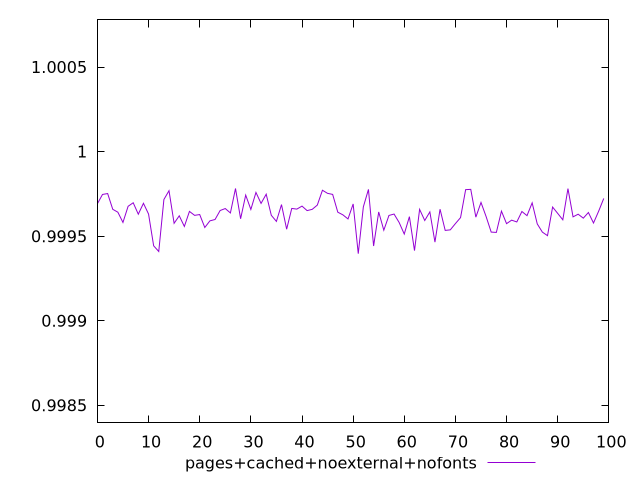
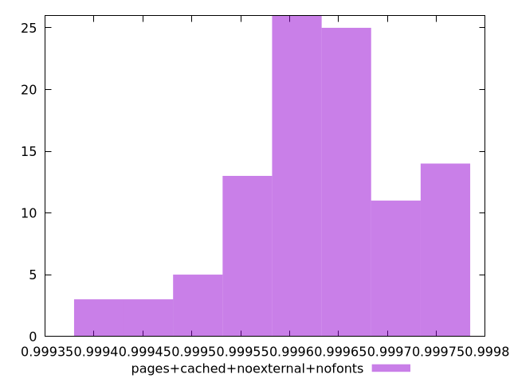
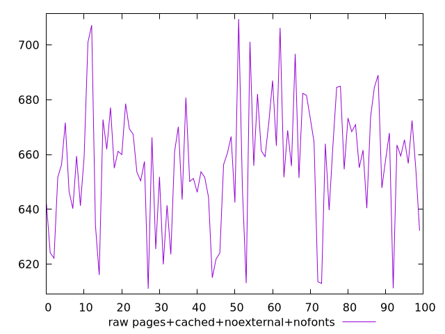
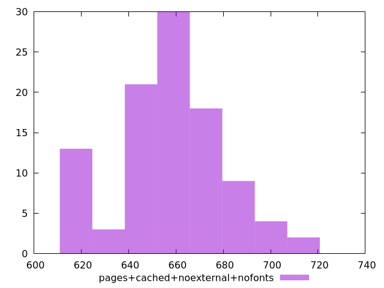

# Report pages+cached+noexternal+nofonts

[parent..](./..)  


## Scores

  

## Score Histogram

  

## Score Indicators

```yaml
min: 0.9993964902094795
max: 0.9997816731966508
range: 0.0003851829871712731
mean: 0.99963053565779
median: 0.999632524251912
stdev: 0.00008438367310399827
skewness: -0.4538570552156563

```

## Raw Values

  

## Raw Values Histogram

  

## Raw Indicators

```yaml
min: 610.9960000000005
max: 709.4680000000006
range: 98.4720000000001
mean: 657.2291600000003
median: 658.6920000000002
stdev: 22.253275723236776
skewness: -0.08957740948903709

```

<style>
  img {
    max-width: 80%;
  }
</style>
      
