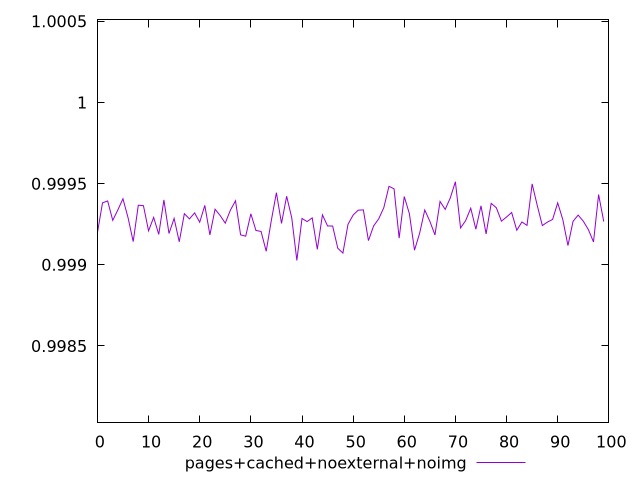
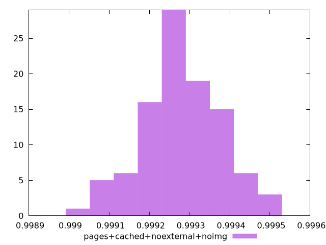
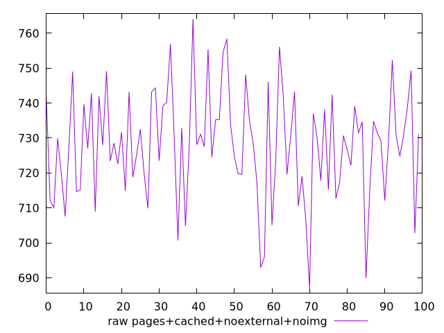
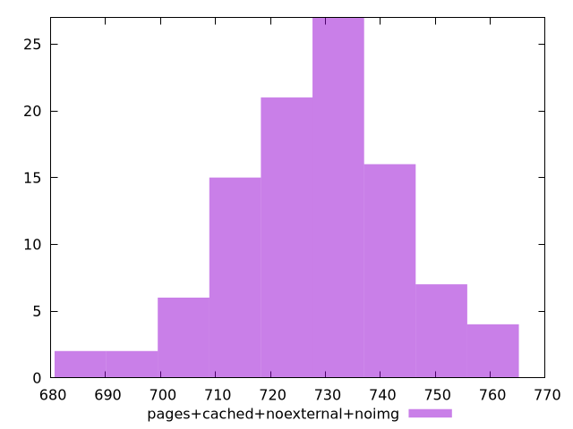

# Report pages+cached+noexternal+noimg

[parent..](./..)  


## Scores

  

## Score Histogram

  

## Score Indicators

```yaml
min: 0.9990270672225982
max: 0.9995115149347426
range: 0.00048444771214439797
mean: 0.9992811621433675
median: 0.9992809779279878
stdev: 0.00009754581796565266
skewness: -0.1042913610555408

```

## Raw Values

  

## Raw Values Histogram

  

## Raw Indicators

```yaml
min: 687.1360000000004
max: 764.1000000000003
range: 76.96399999999983
mean: 727.9622800000002
median: 728.7980000000001
stdev: 15.431541830990179
skewness: -0.19839505298679774

```

<style>
  img {
    max-width: 80%;
  }
</style>
      
