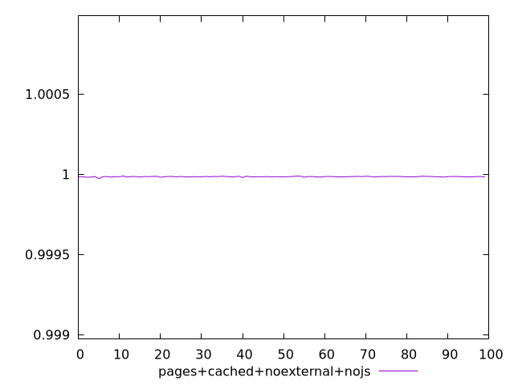
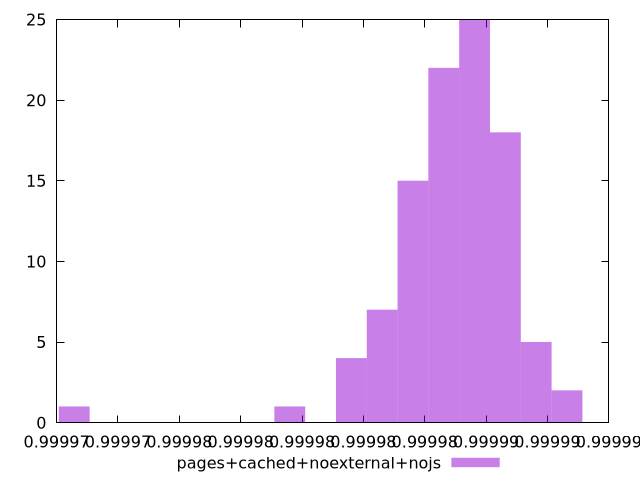
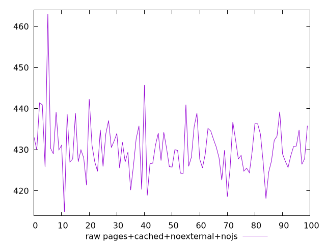
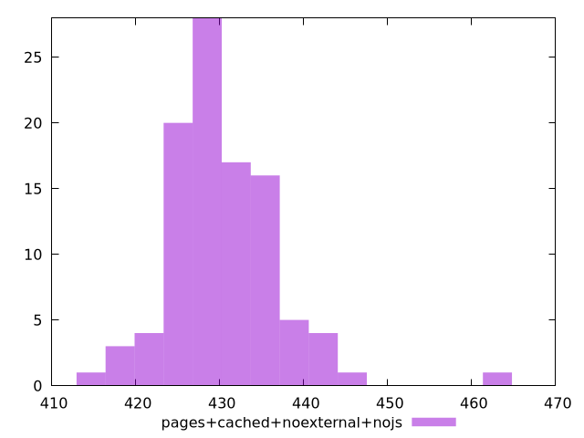

# Report pages+cached+noexternal+nojs

[parent..](./..)  


## Scores

  

## Score Histogram

  

## Score Indicators

```yaml
min: 0.9999727943604848
max: 0.9999888867906552
range: 0.00001609243017042239
mean: 0.9999848779607767
median: 0.9999851456103912
stdev: 0.000002025995701588591
skewness: -2.2504223750763295

```

## Raw Values

  

## Raw Values Histogram

  

## Raw Indicators

```yaml
min: 414.89599999999984
max: 463.036
range: 48.14000000000016
mean: 430.2810400000001
median: 429.6919999999999
stdev: 6.499278301350094
skewness: 1.289381021344473

```

<style>
  img {
    max-width: 80%;
  }
</style>
      
